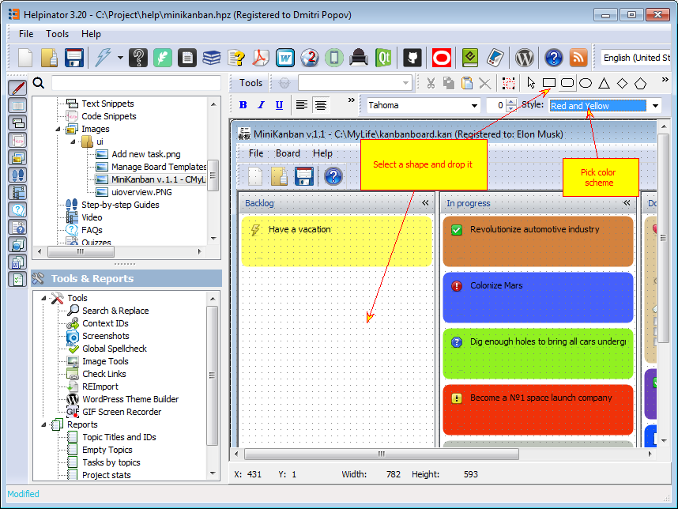
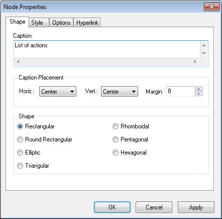

=================
Adding callouts
=================

Now let's add some callouts to the screenshots. Select an image to work on take a look at shapes toolbar.

Select shape style (we use "Red and Yellow" here). Click on rectangle shape on the toolbar and draw it where you want callout to appear. Now select "Arrow" shape and connect rectangle with a target element, in our case the toolbar buttons. Double click the rectangle and enter text into "Caption" field. 

Activate editor

Add caption

