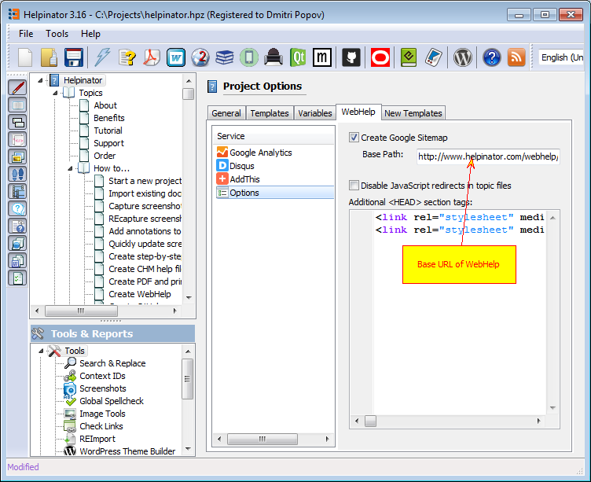

==================================
Analytics and Social Integration
==================================

Helpinator allows you to add **Google Analytics**, **AddThis** and **Disqus** integration to WebHelp without altering HTML templates. All you need to do is to paste integration code provided by these services into corresponding project options.

WebHelp analytics and social integration

