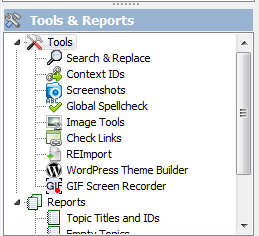
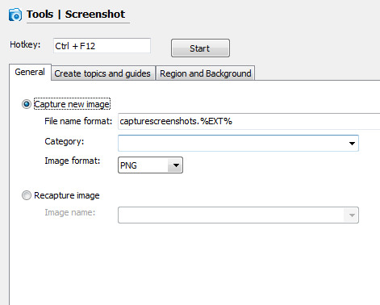
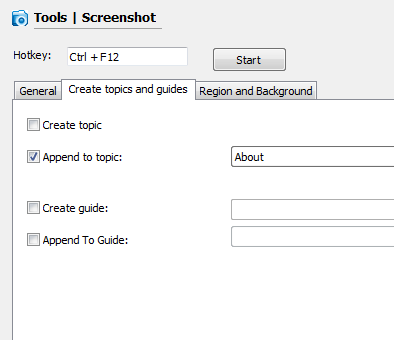
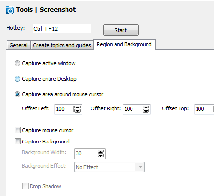

=====================
Capture screenshots
=====================

1. Select "Screenshots" node

2. Set up general options

Select wether you want to capture new image or REcapture (update) existing one. You can also specify image name mask, category to store it to and image format.

3. Create topics and guides

Check whether you want to create a new topic for captured image, append it to an existing topic, create new step-by-step guide or append to existing guide.

4. Additional capture options

You can select to capture only active window, entire desktop, area around mouse cursor, capture mouse pointer and background around capture window with effects.

