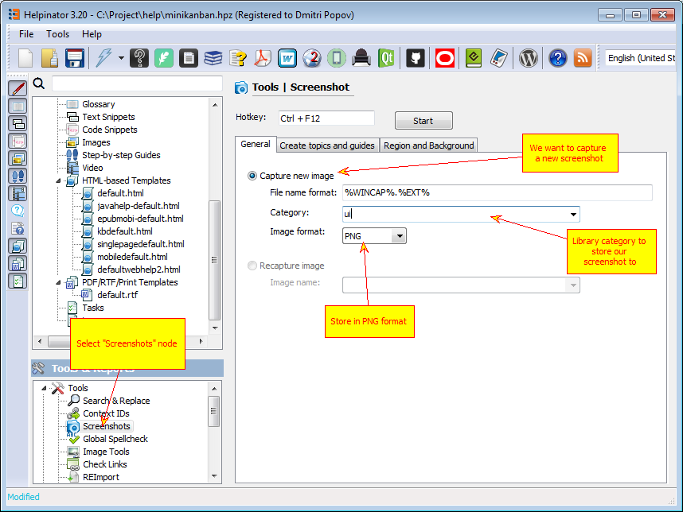
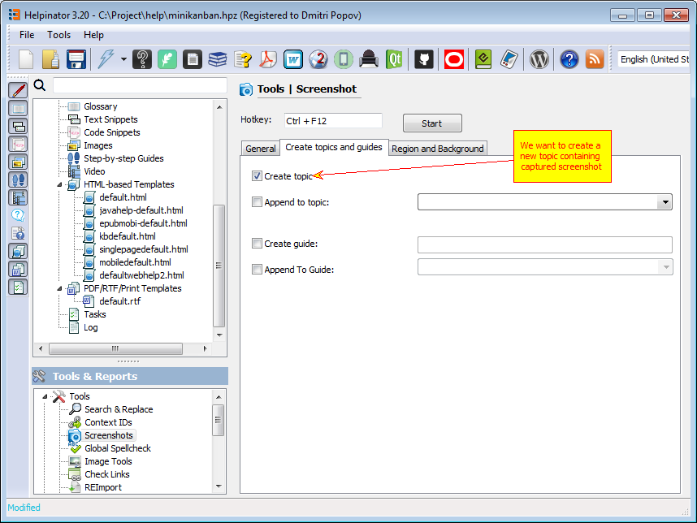
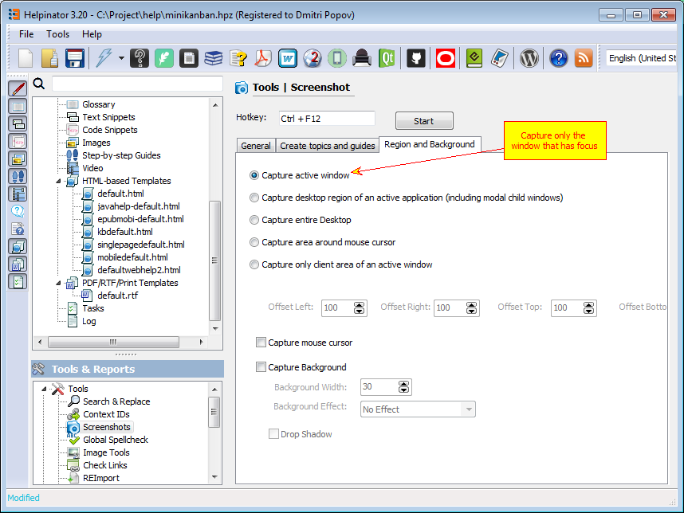
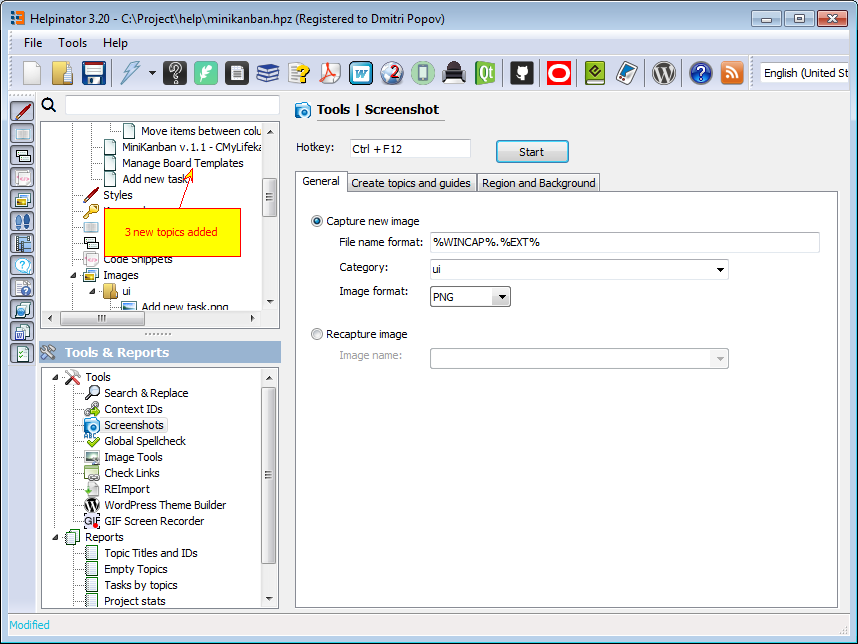
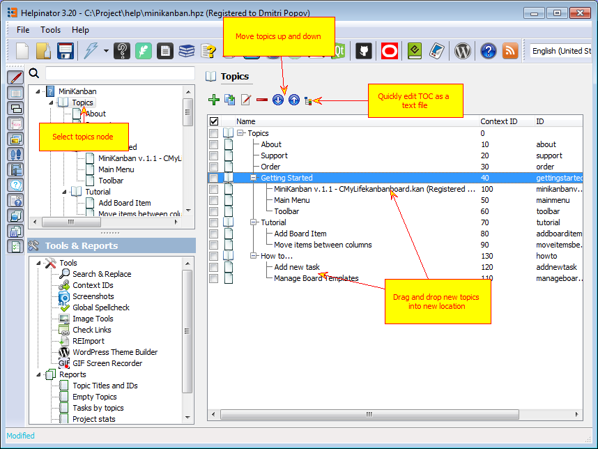
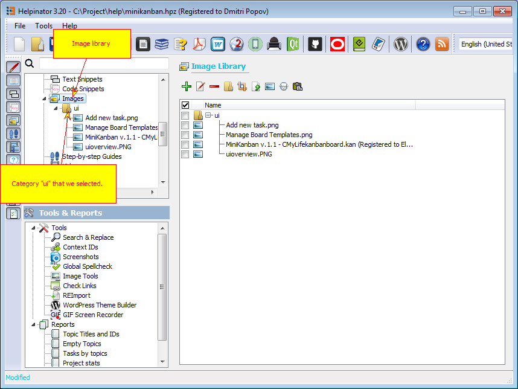

=======================
Capturing screenshots
=======================

Helpinator allows you to capture screenshots and automatically create topics with captured screenshots. Helpinator stores screenshots to the project's image library where you can manage/edit/update imges easily.

First select "Screenshots" node in the project tree view. 

Screenshots - General tab

Screenshots - Create topics and guides.

Screenshots - Select what to capture.

Make required settings as shown above and click "Start". Now when you press hotkey combination Helpinator captures active window and stores it to the image library. We'll capture screenshots of main form, progress form and log.

Let's check created topics: 

Topics created by screenshot tool

Newly added topics have the name of the captured window as a title, and a reference to the captured image stored in the image library.

Now, let's reorder created topics and and move them under "UI" node. Just drag and drop them to the "UI" node, then rearrange using "up" and "down" arrows on the toolbar. 

Rearrange topics

Let's take a look at the library. Captured images are now there under "ui" category. 

Image library

