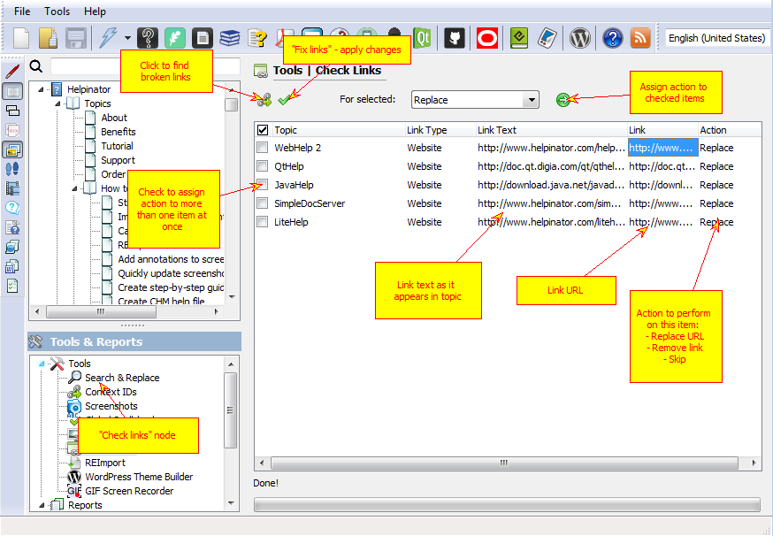

=============
Check Links
=============

This tool allows you to find broken links in all topics of the project automatically. It shows a report grid with link details and a name of the topic where the broken link was found.

You can edit links right in the grid and then click "Fix links". For each link you can select to:

1. Replace broken link with a new URL
2. Remove link
3. Skip this item during next check.

Check Links

