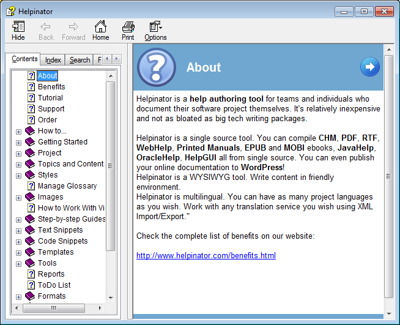
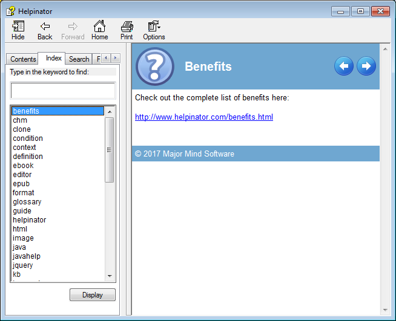
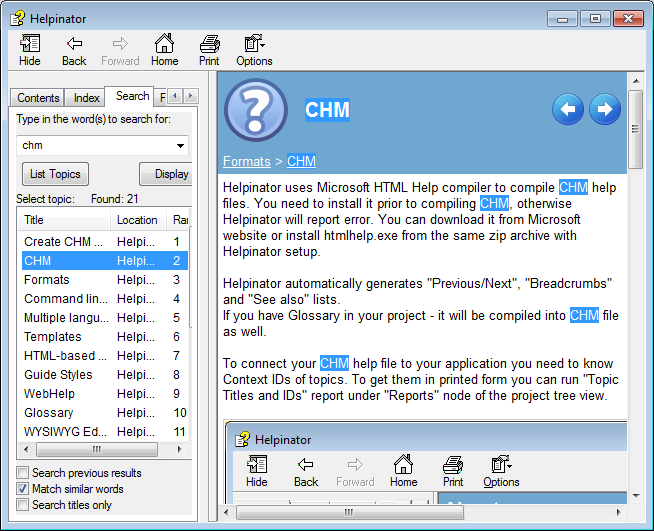

=====
CHM
=====

Helpinator uses Microsoft HTML Help compiler to compile CHM help files. You need to install it prior to compiling CHM, otherwise Helpinator will report error. You can download it from Microsoft website or install htmlhelp.exe from the same zip archive with Helpinator setup.

Helpinator automatically generates "Previous/Next", "Breadcrumbs" and "See also" lists.

If you have Glossary in your project - it will be compiled into CHM file as well.

To connect your CHM help file to your application you need to know Context IDs of topics. To get them in printed form you can run "Topic Titles and IDs" report under "Reports" node of the project tree view.

CHM - topic

CHM - index

CHM - Search

