===============
Cloned Images
===============

Helpinator’s “Image Library” allows you to create “cloned” images. What are they?

Let’s say you have a big complicated tool bar in your application. You need to explain your users how to work with it, what buttons trigger specific actions, all grouped by specific tasks… This probably will require a lot of copies of the toolbar image, each one with it’s own callouts, arrows and text boxes, but all with the same background – application toolbar.

Now suppose that during project evolution toolbar changes significantly – updated icons, some new buttons. Now you need to update a bunch of images to reflect changes in the UI. That could be a nightmare! But not if you use Helpinator’s image library and “cloned” images.

In the following example will’ take a look at one simple but very common situation. Suppose you have a set of images in your project, describing different parts of the toolbar, but all of them contain application name and version in the window title like this:

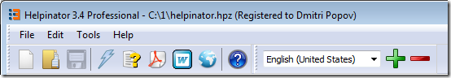

One image has callouts for language bar:

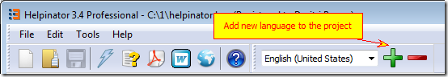

Another for compile buttons, and so on…

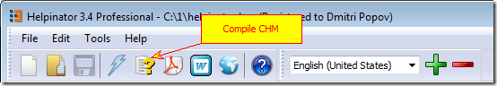

We’ll make the first one “donor” image and two other images will be cloned.

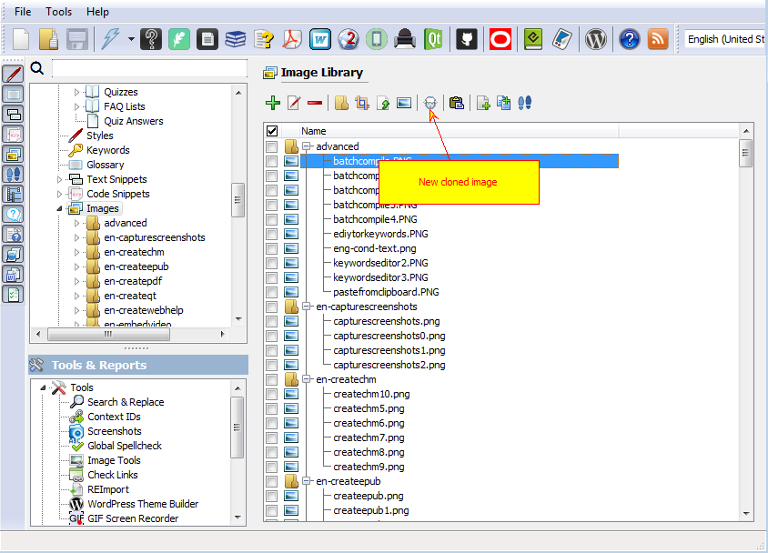

New cloned image

Now suppose application version changes to 3.5. You need to update all those images. Luckily you have only one donor image and two clones, so you only need to update one image.

Select Tools->Replace Image when donor image is open in the editor.

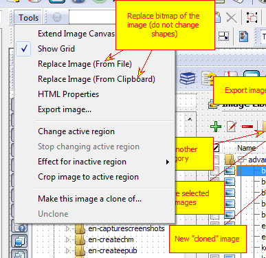

Replace bitmap

Now all cloned images are updated:

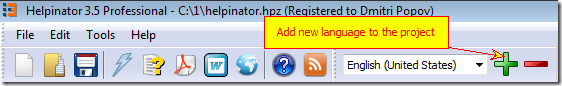

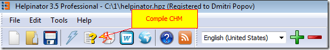

There's also a handy feature that is called "Active region". It allows to use only a square portion of the donor image. Define active region and set "Effect for..." to "Crop".

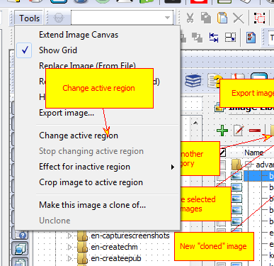

Change active region

**Example.**

This image is the large donor image. But we do not need it as a whole, more than that, it will be discussed in different topics.

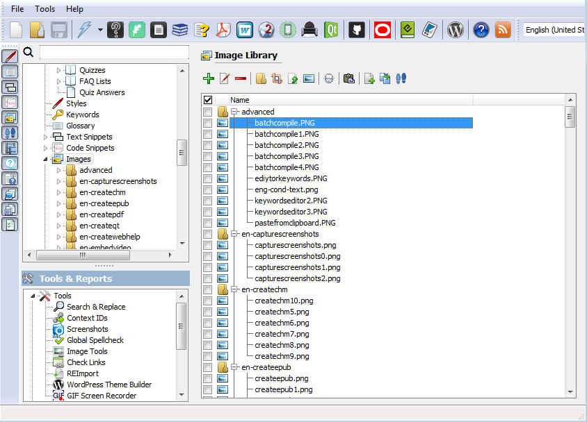

Donor

So we can create two clones and define different active regions for them.

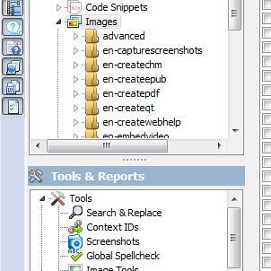

Clone 1

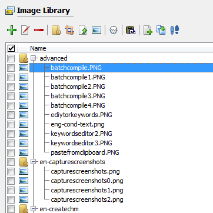

Clone 2

