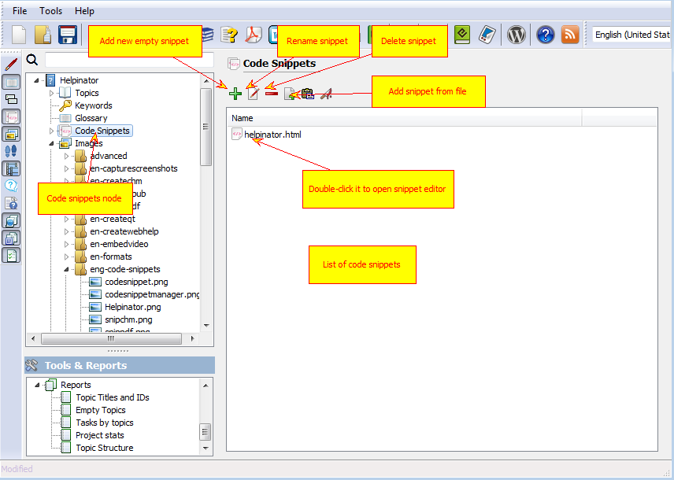
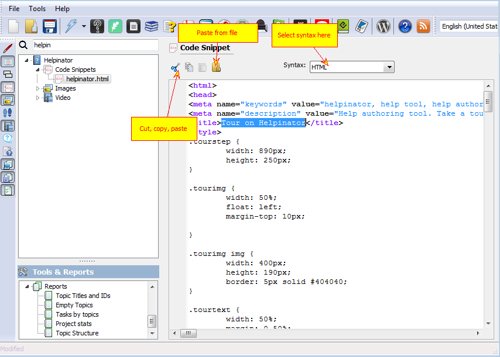

===============
Code Snippets
===============

Code snippets are portions of code or markup with syntax highlight. Helpinator allows you to manage code snippets using snippet library and embed them into topics using special placeholders. Though Helpinator is not intended to document source code, code snippets allow you to document APIs, HTML/XML samples and other supplementary code.

The picture below shows how to use code snippets manager.

Code Snippet Manager

Code snippet editor allows you to view and edit code snippet with syntax highlighting. You can also change highlighting for the snippet.

Code Snippet

