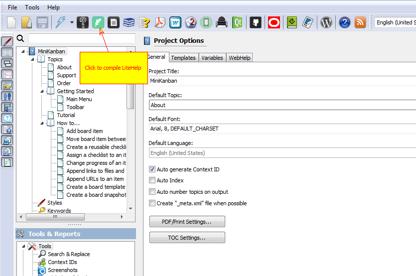
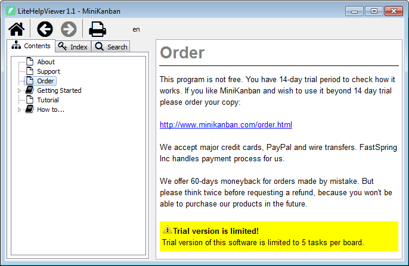
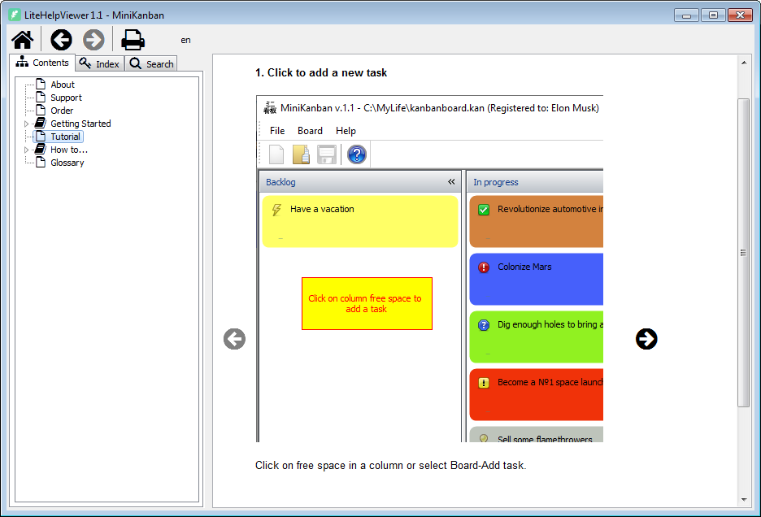
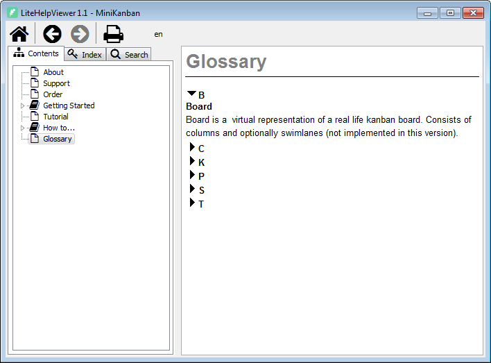

=======================
Compiling a help file
=======================

OK, here we go. Everything is ready and we can now see our help file in all it's glory. We are going to compile a LiteHelp help file at this step. LiteHelp is a lightweight portable help system for desktop Windows apps created by Major Mind Software as a replacement for CHM (HTML Help).

Compile LiteHelp

Below is the "Warning" aside, rendered with exclamation icon and yellow background.

"Warning" aside in LiteHelp.

Our step-by-step guide as a slideshow with navigation.

Step-by-step guide in LiteHelp

Glossary in LiteHelp

