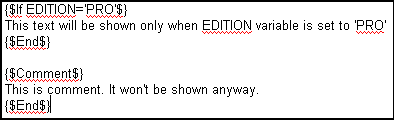
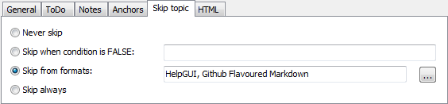

=========================
Conditional compilation
=========================

Conditional compilation allows you to modify Helpinator output based on values of user-defined variables.

It may be used in both of two ways:

1. To skip portions of text
2. To skip one or more topics entirely.

To skip/include portions of text Helpinator has built-in IF directive which has the following syntax:

Conditional Compilation

In the first case IF clause allows to skip the text inside it when "EDITION" variable has "PRO" value.

In the second case the text will be skipped without any conditions. This makes COMMENT tag a good way for text reviews.

To skip a topic from output completely (e.g. even from TOC) there's "Skip topic" tab in the topic editor

Skip the topic

In the case above Helpinator will skip the topic entirely when EDITION is NOT equal to 'PRO'.

Other options include:

* **Skip topic from certain formats** - for example a topic contains video samples and you might not want it in PDF format (since it will be empty) so select "Skip from formats" and check "PDF"
* **Skip always** - always skip this topic, for example if it's not ready yet.
