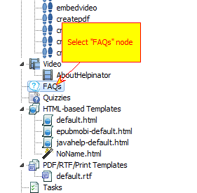
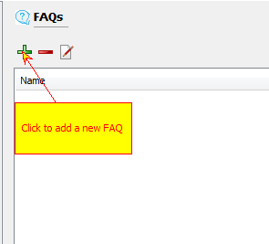
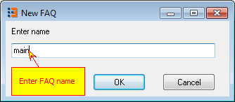
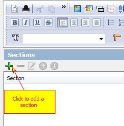
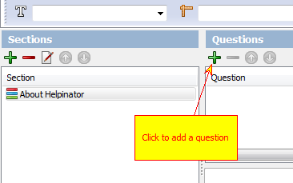
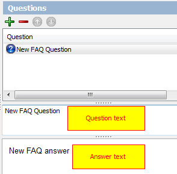
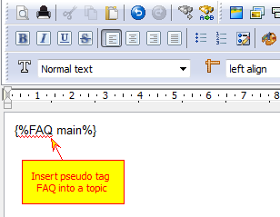

==============
Create a FAQ
==============

1. Select "FAQ" node

Select "FAQs" node in the project tree view.

2. Add a new FAQ

Click "+" sign to add a new FAQ.

3. Enter FAQ name

Enter short FAQ name to reference it.

4. Add a FAQ section

Click "+" sign under "Sections" group to add a new FAQ section.

5. Add a question

Click "+" sign under "Questions" group to add a new question.

6. Edit question

Edit question text and answer. Question text is plain text, answer is rich text like any topic.

7. Embed

You can embed your newly created FAQ into a topic with FAQ pseudo tag. It will be replaces with an actual FAQ at compile time.

