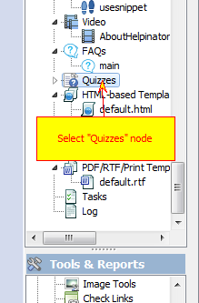
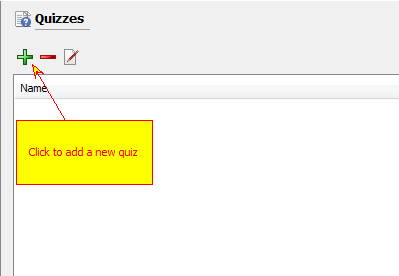
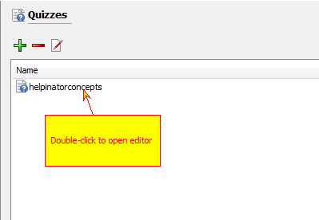
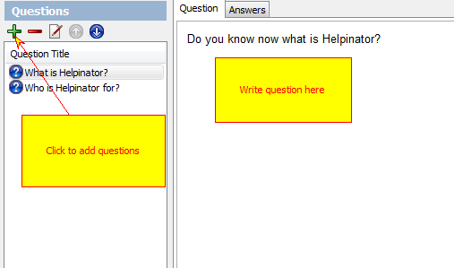
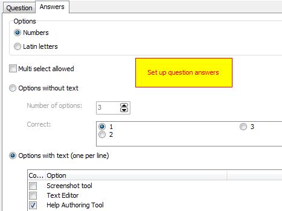
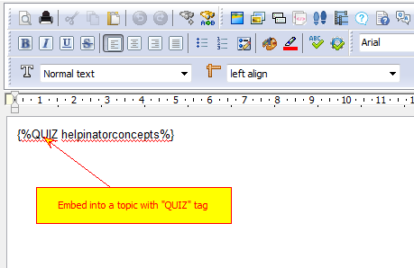

===============
Create a Quiz
===============

1. Select "Quizzes" node

Select "Quizzes" node in the project tree view.

2. Add a new quiz

Click "+" button to add a new Quiz

3. Open editor

Double click the newly create quiz to open quiz editor

4. Add a question

Click "+" icon to add question, write question text in "Question" tab.

5. Set up answers

Select answers numbering, multiple correct answers and how options will be generated.

6. Embed into a topic

Embed a quiz into a topic with "QUIZ" tag.

