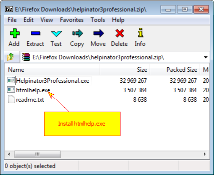
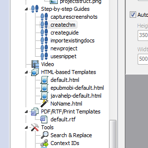
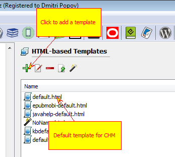
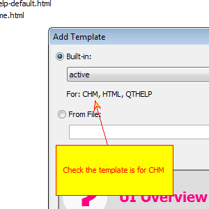
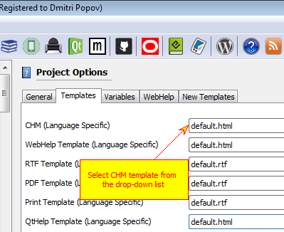
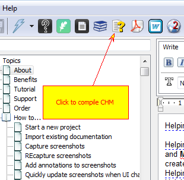

======================
Create CHM help file
======================

1. Install HTMLHELP.EXE

First of all you need HTMLHELP.EXE (a tool from Microsoft that allows you to compile CHM help files). For your convinience it is packed in the same zip archive with Helpinator.

2. Check "HTML-based templates"

Check "HTML-based templates" node of the project tree view. It has default.html template for CHM output but you can check for more built-in templates.

3. Click "+" to add more CHM templates

Click on green plus sign and "Add template" dialog opens.

4. Select a template from the drop-down list

Select a template from the drop-down list. A preview od compiled topic appears at the bottom. Note that there is "For: CHM" text below template title.

5. Select added template from the drop-down list

Now you need to activate your template. Select root node in the project tree view, browse to "Templates" tab and select template from the "CHM" drop-down.

6. Click "Compile CHM" on the main tool bar.

Now you can click "Compile CHM" on the main tool bar and Helpinator will compile a CHM help file for you.

