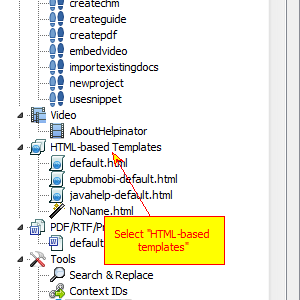
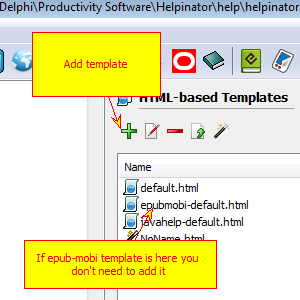
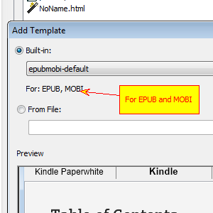
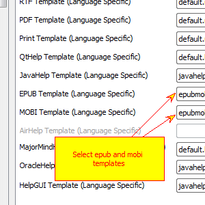
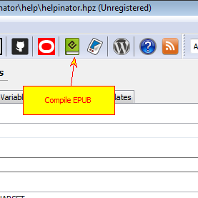
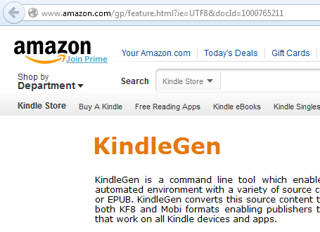
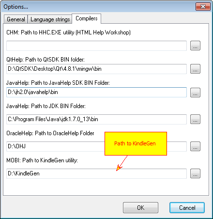
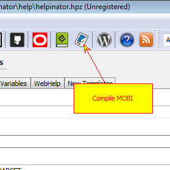

=============================
Create EPUB and MOBI ebooks
=============================

1. Select "HTML-based templates"

Select "HTML-based templates" node in the project tree view and check for "epubmobi-default.html" template. If it is in place, proceed to step 5.

2. Click "Add template"

Click "+" to add epub-mobi template. IF you can see it in the list, you don't need to add it.

3. Select epub-mobi template

Select "epub-mobi" template from the list and click "OK"

4. Set epub-mobi template

Select root node in the project tree view and browse to "Templates" tab, then select "epub-mobi" template from drop-down lists for EPUB and MOBI formats.

5. Compile EPUB

Now you can click "Compile EPUB" to create epub file. To compile MOBI you need to take some more steps.

6. Download KindleGen

To compile MOBI you need to download and install KindleGen - free command-line tool from Amazon that allows to create MOBI ebooks.

7. Set path to KindleGen

Select Main Menu -> Tools -> Options and enter path to KindleGen utility.

8. Compile MOBI

Now you can click "Compile MOBI" to create mobi file.

