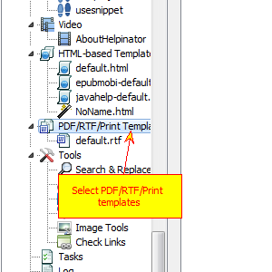
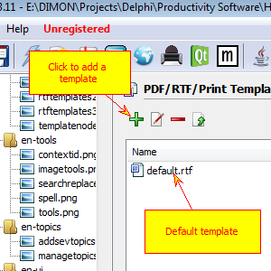
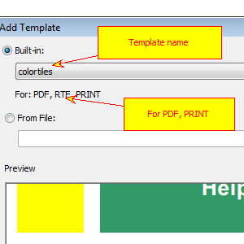
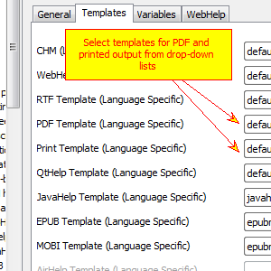
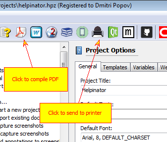

================================
Create PDF and printed manuals
================================

1. Select "PDF/RTF/Print templates"

First of all, let's check what template you can use for PDF output besides default template in your project.

2. Click "Add template"

Currently the list of templates cosists only of "default.rtf", click "+" sign to add more templates.

3. Select new template

"Add template" dialog appears. Now you can select from "Built-in" drop-down list. Template preview at the bottom updates automatically. Note "For: PDF" label below template name.

4. Set new templates for PDF and print

Select root node in the project tree view, then "Templates" tab and select new templates for PDF and PRINT. However you can keep "default.rtf" template, if it's good enough for you.

5. Click "Compile PDF"

Now you can click "Compile PDF" or "Print" buttons on the main tool bar to create a pdf file or send output to printer.

