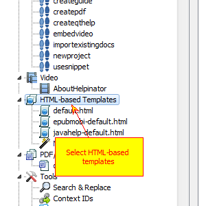
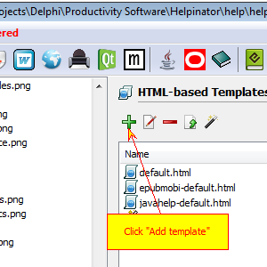
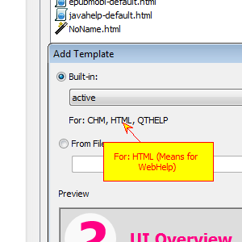
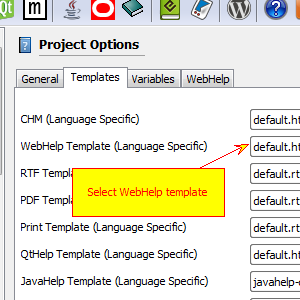
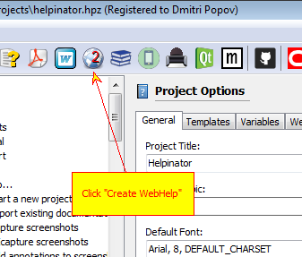

================
Create WebHelp
================

1. Select "HTML-based templates"

2. Click "Add Template"

3. Check for WebHelp templates

4. Set WebHelp template

Select root node in the project tree view, then "Templates" tab and set WebHelp template (or leave default.html there).

5. Click "Create WebHelp"

Click "Create WebHelp" button on the main tool bar.

