===========================================
Creating a tutorial (a step-by step guide
===========================================

Helpinator has built-in tutorial maker, that allows you to make tutorials from images in the project image library.

First off we need to prepare images for our tutorial. We already captured all application dialogs but added callouts to them that describe UI elements, not the tasks we need to document. So we'll use another Helpinator's unique feature and create "cloned" images from the images already in the library. This will allow us to add callouts exactly for our tutorial.

We are about to create a step-by-step guide that shows how to add a new task to the board.

For this purpose we will add several clones of the image that contains screenshot of "Add a task" dialog. This dialog has a number of edits and switches, so we will have to split the explanation into several steps. However it's impractical to use different images with the same screenshot. And it's hard to maintain. Helpinator allows to create "cloned" images of the same donor, so there's no need to manage more than one copy and we will need to update just one image when the dialog changes. 

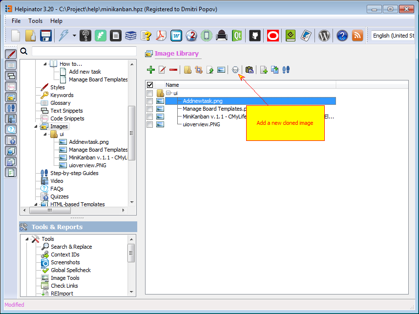

Manage images add clone

"New cloned image" dialog allows to add several clones of a donor image at once and store them to selected category. 

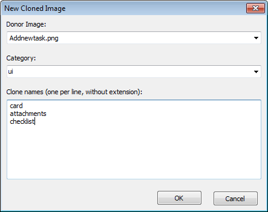

New cloned images

Now we can add callouts to the images of our tutorial on every step. 

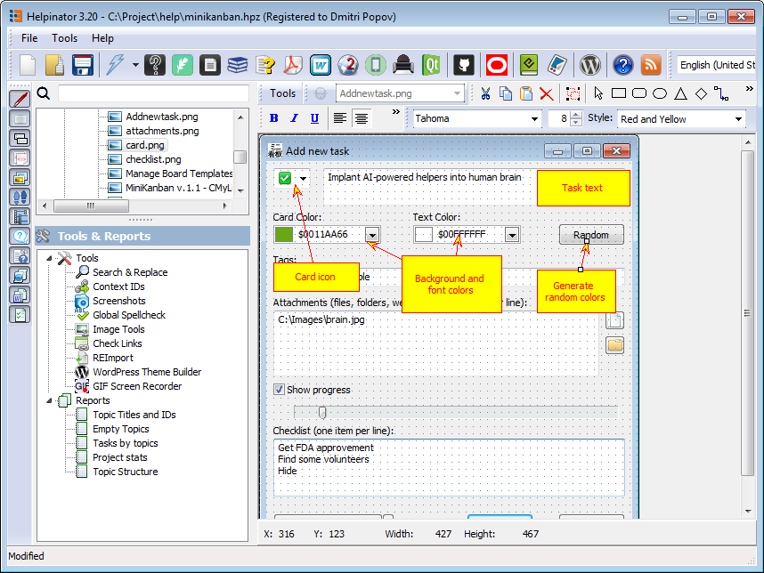

Add callouts.

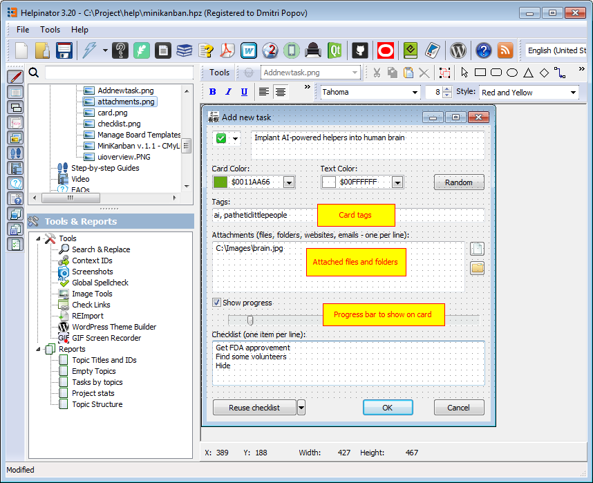

Callouts for attachments.

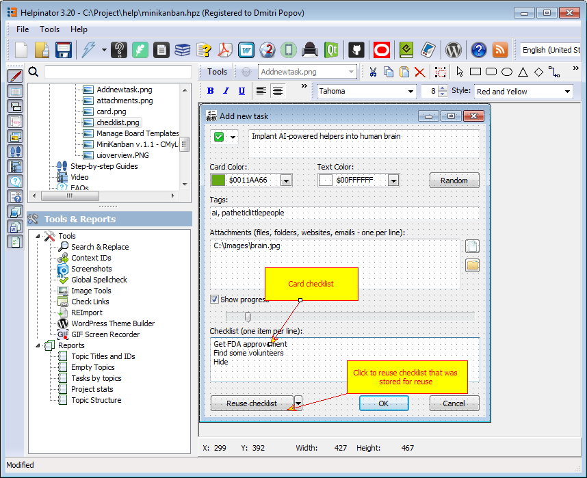

Callouts for checklists.

Now we can go and create a tutorial itself. 

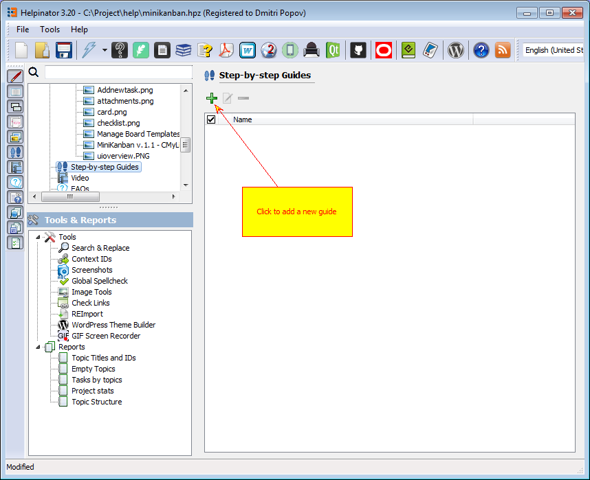

Manage guides

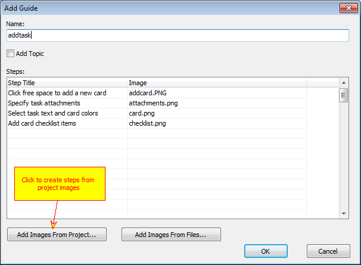

Add guide dialog

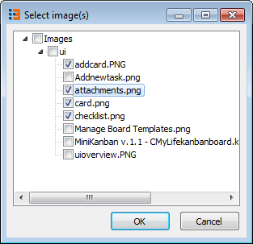

Step images

By default tutorial steps have the same names as the images selected. We need to rename them and place in correct order. 

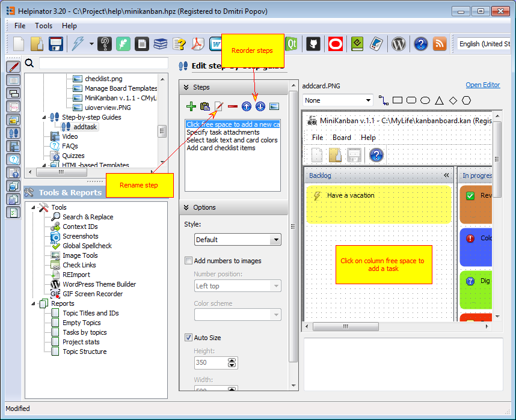

Rename and reorder steps.

Now you can write step text into the field below the step image.

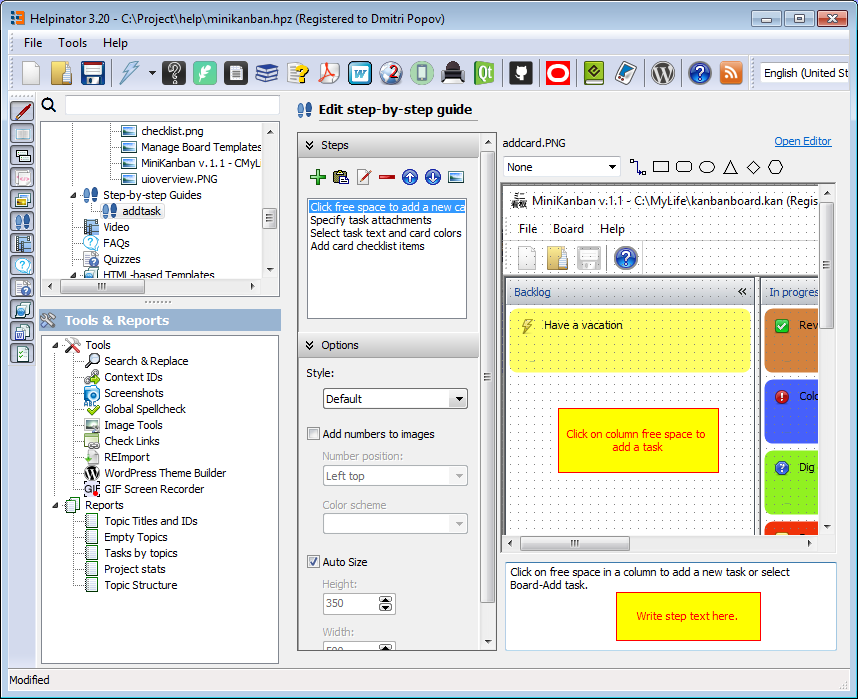

Write step text

After all step texts are ready we can insert a placeholder for our tutorial into a corresponding topic. Topic named "Tutorial" in our case.

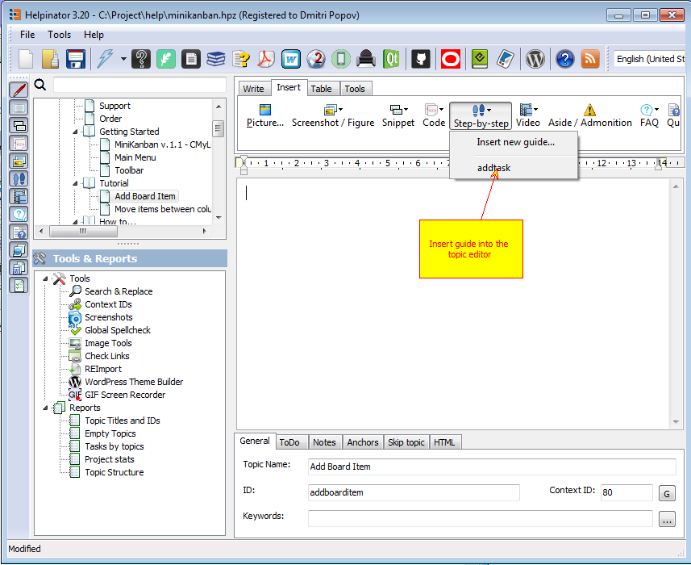

Insert guide using a toolbar

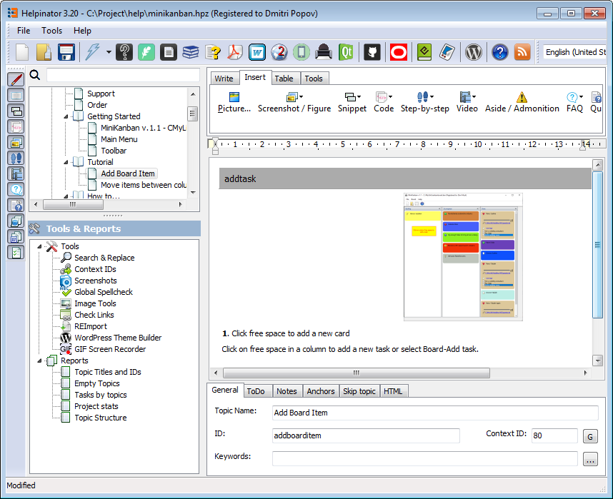

Guide in topic editor

