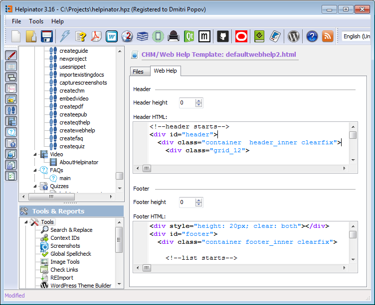

=======================
Adapt to your website
=======================

Helpinator allows you to adapt WebHelp to your website design. There's "WebHelp" tab in the CHM/WebHelp template editor with two groups: "Header" and "Footer". There you can paste HTML code that will be shown above and below WebHelp panes.

Example can be seen in Helpinator's own WebHelp:

`http://www.helpinator.com/webhelp <http://www.helpinator.com/webhelp>`_

Adapt WebHelp to your site

