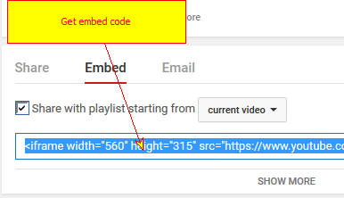
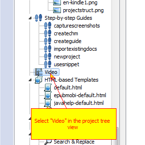
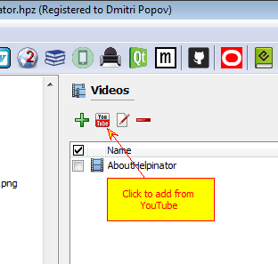
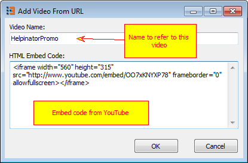
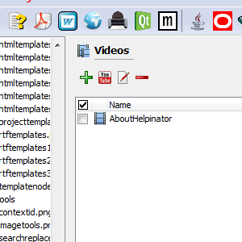
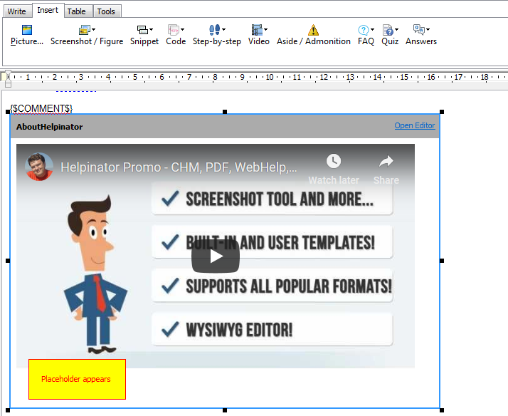

=========================================
Embed Video from YouTube, Vimeo and etc
=========================================

1. Get HTML Embed Code from service provider

First of all you need to get your video embed code from video service provider (YouTube in this case).

2. Select "Video" node

Select "Video" node in the project tree view.

3. Click "Add video from YouTube"

Click "Add video from YouTube, Vimeo..."

4. Enter name and embed code

Enter name to refer to this video and embed code from service provider.

5. Video appears in the video library

Now your video is in project's video library and you can embed it into topics.

6. Click "Insert Video"

.. image:: images/embedvideo3.png

Select a topic to insert video into, place cursor where you want your video to appear and click "Insert Video" on the editor tool bar.

7. Placeholder appears

Video placeholder appears in the position of cursor. Now Helpinator will insert your YouTube video into compiled documentation if the selected output format supports video. 

