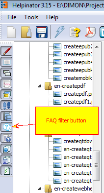
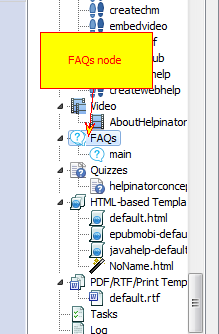
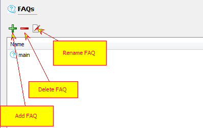
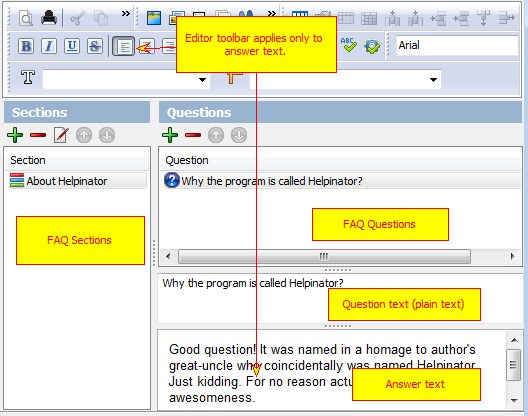
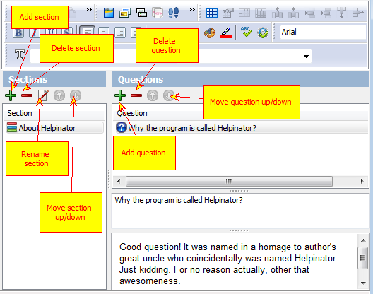

=====================
FAQ Editor Overview
=====================

To open up FAQ editor first select the FAQ node in the project tree view. If there is no "FAQ" node check out the FAQs are not filtered out from project view, corresponding button on the leftmost toolbar should be checked.

FAQ filter button

FAQs node

List of FAQs looks like this:

List of FAQs

Double click a FAQ and FAQ editor appears:

FAQ Editor

Edit Questions

