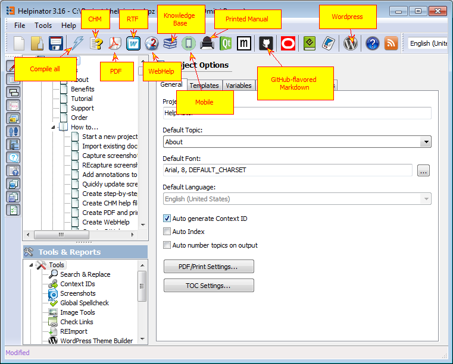

=========
Formats
=========

Helpinator supports the following output formats:

1. CHM (Compiled HTML Help)
2. PDF
3. RTF (with some limitations)
4. WebHelp
5. Printed manuals
6. QtHelp (Qt Library native help file format)
7. JavaHelp (Java native help file format)
8. EPUB (e-books format)
9. MOBI (Kindle e-books format).
10. OracleHelp
11. HelpGUI
12. MajorMinHelp
13. Publish to Wordpress CMS

CHM, WebHelp, QtHelp, JavaHelp, EPUB and MOBI are all HTML-based and rely on HTML-based templates. JavaHelp uses reduced set of HTML features therefore it needs specially formatted HTML templates. EPUB/MOBI are book-oriented and HTML templates for them also differ in formatting and structure.

OracleHelp is an advanced HTML-based help system developed by Oracle Inc. It is multilingual, and can be used as a local help file and WebHelp using the same compiled project.

HelpGUI is a lightweight Java-based help system for small apps.

MajorMindHelp is experimental multilingual HTML-based help system, at this time for Delphi only.

Wordpress is the most popular CMS right now, so if you run your project website on this help system you don't need to mess with non-compatible webhelp systems, you can publish online documentation right to your CMS.

CHM is primarily Windows-based help file format, though there are some viewer implementations for other platforms too. WebHelp, QtHelp, JavaHelp, HelpGUI and OracleHelp are cross-platform formats.

PDF, RTF and printed manuals rely on RTF templates. PDF and Printed manuals are almost identical, except that Printed manuals are sent directly to printer and thus avoid image quality loss during compression. But PDF files have useful "Outline" with document structure and direct links to topics. RTF files are a limited version of PDF output, they do not have headers and footers.

Formats

