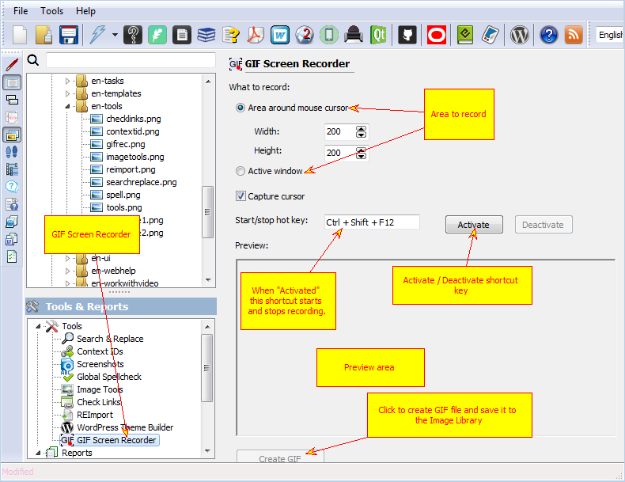

=====================
GIF Screen Recorder
=====================

GIF Screen recorder allows to record short animated GIF files instead of static screenshots. You can select what area do you want to record - fixed rectangle around the mouse cursor or an active window and redefine a shortcut that starts and stops recording.

When you finish recording captured frames appear in the "Preview" area. If you are happy with it you can click "Create GIF" and store the file in the project's Image Library.

Later you can use it in topics and step-by-step guides.

However, remember that animated files break single-sourcing, PDF and printed manuals allow only static images.

GIF Screen Recorder

