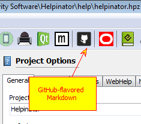
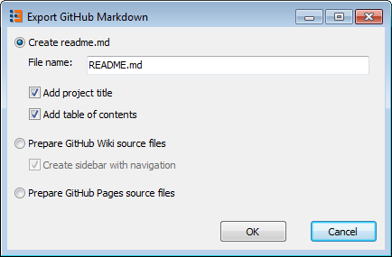
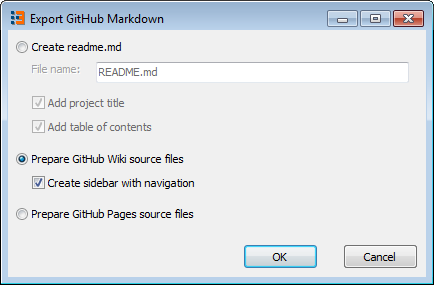
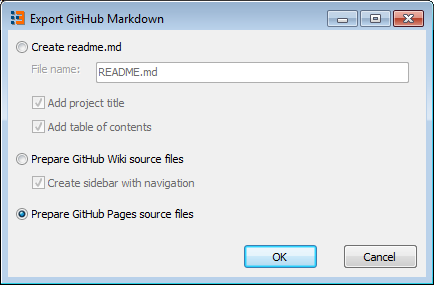

==========================
GitHub-flavored Markdown
==========================

Markdown is a plain-text format for writing rich formatted documents. Of course you can create Markdown files in any text editor but when it comes to handling large projects with images, tables, glossaries and how-to's, you definitely need a helper tool. Helpinator brings the power of a conventional help authoring tool to the world of Markdown!

GitHub-flavored markdown is a superset of regular markdown tailored to be used to document GitHub projects. Basically there are 3 ways you can use Markdown on GitHub:

1. To create a readme.md file in your project root folder. This text GitHub shows when a user visits project page on GitHub.
2. To create a large project Wiki ("Wiki" tab of the project)
3. To create GitHub Pages - a static project website platform that you can link your own domain to. It is a kind of free website hosting limited to static sites.

All 3 are Markdown files, but in the first case Helpinator will create a single markdown file from your project with project title and table of contents. In cases 2 and 3 Helpinator will create one markdown file per project topic, the difference is in file naming and TOC linking. Besides that Wiki mode allows to create a sidebar with table of contents for navigation. In all 3 cases images will be published into the "images" folder next to your markdown files, do not forget to commit this folder using git!

Click "Github-flavored Markdown" icon on the main toolbar, "Export GitHub Markdown" dialog appears.

**To generate README.MD** file from your project select the first option "Create readme.md". Here you can change file name of the output file and tell Helpinator that you want a project title and a table of contents included. If your project is small you can choose not to add the table of contents. Click OK and the file gets generated in the "gitmarkdown" sub folder in the folder where your project is stored.

**To prepare source files for project Wiki** select the second option. You can choose to add optional sidebar with table of contents for navigation. Helpinator also creates required "Home.md" file that GitHub Wiki uses as a home page and places project title and table of contents in it. Click "OK" and commit generated files with "images" sub folder into the Wiki repository (it's name matches your project repository with ".wiki" postfix added to it).

To create source files for GitHub Pages select the 3rd option. Helpinator creates one markdown file per topic plus "index.md" file with table of contents. You'll need to commit them to the root folder or "docs" sub folder of your repository and set up GitHub pages on the Settings tab of your repository.

