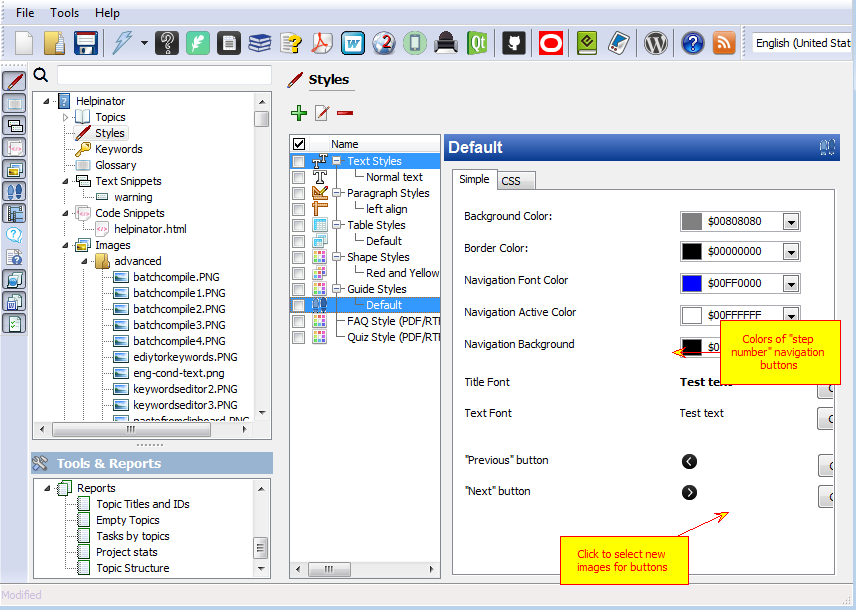
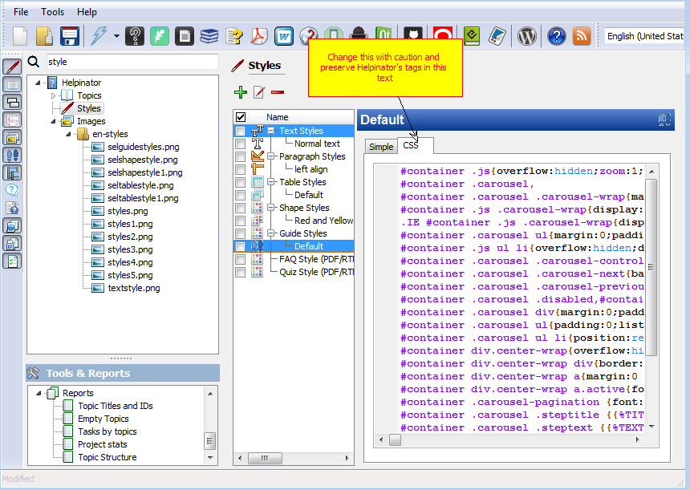
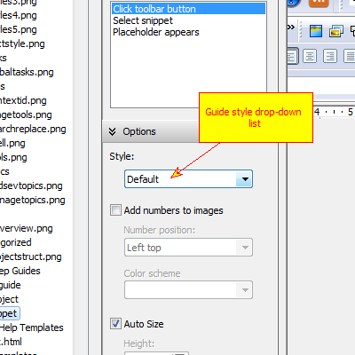

==============
Guide Styles
==============

Guide styles allow you to change appearance of Step-by-step Guides in compiled documentation. Most of it Helpinator uses only when compiling CHM and WebHelp, PDF/RTF/Printed Manuals do not use "slideshow" effect, so only font settings will be taken into account when compiling them.

Guide Styles

CSS tab contains highlighted CSS code that will be inserted into HTML-based help output (CHM and WebHelp).

Here you have more control over Guide appearance in this kind of documentation, but be careful.

CSS of Guide Styles

To use your newly created guide style select it from corresponding drop-down list in the guide options area.

Assign new style to a guide

