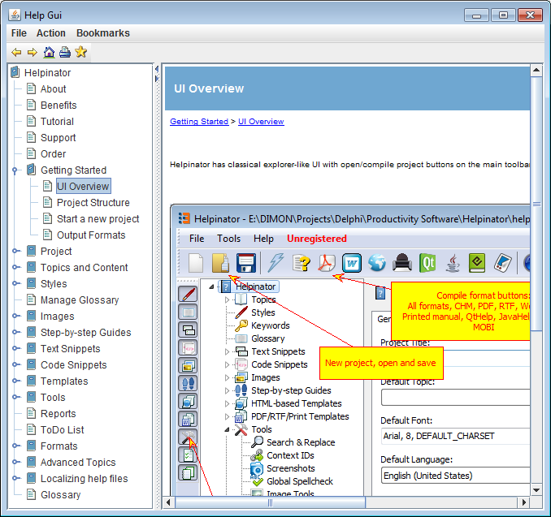

=========
HelpGUI
=========

HelpGUI is a lightweight help system for small Java applications. It has no keyword lookup or built-in search, but the best part is that it is small.

You can download it here:

`http://helpgui.sourceforge.net/ <http://helpgui.sourceforge.net/>`_

To compile HelpGUI:

1. Download and install JDK

2. Set up Helpinator options for JDK just like in case of  `JavaHelp <#tB23A4E21844A4C3A925C7150AC9C4C15>`_

Compiled HelpGUI help file looks like this:

