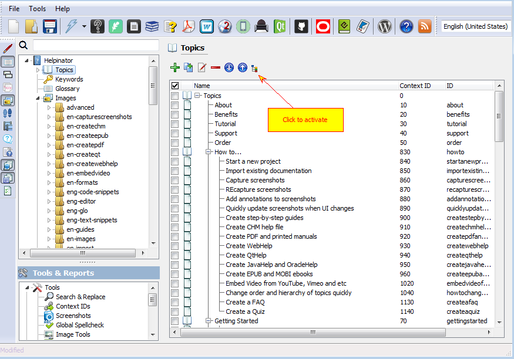
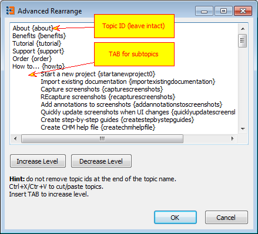

==============================================
Change order and hierarchy of topics quickly
==============================================

Version 3.11.3 introduces new feature called “Advanced rearrange”. It allows to quickly change order, titles and hierarchy of multiple topics at once. Normally Helpinator allows to change order of topics and their position in the topic tree by dragging and dropping topics in the topic manager. It is good for a topic or two but is very uncomfortable and time-consuming when you need to change places of several topics in a large project (say, after mass-importing html/rtf files).

To activate this feature select “Topics” node and click the button shown on the image below.

Rearrange topics

It opens up “Advanced rearrange” window. This window is a simple plain text editor with a topics tree converted to it’s plain text representation. Each line has a topic title and topic id in brackets at the end of the line. If a topic is a subtopic, it’s line starts with a TAB (one for level 1 subtopics, two TABS for level 2 and so on).

Advanced Rearrange

What you can do here:

==

==

Cut/Paste topics en masse. Select several lines with your mouse or Shift+cursor, click Ctrl+X to cut them, place cursor into their new location and click “Ctrl+V” to paste. 

==

==

Change levels – just insert/remove TABs at the beginning of the line. To move several topics to another level (e.g. to insert TAB into several lines) select them as told above and click “Increase Level”. This will insert TABs into several lines at once. “Decrease level” works the same way. 

==

==

Rename topics. It’s OK to change topic titles as long as you keep ID part at the end of each line intact.

What you CAN’T do:

==

==

Change or delete topic IDs. They are used for identification, so it will cause an error. 

==

==

Delete topics – to delete topics please use corresponding command of the topic manager. Deleting topics here will cause an error. 

==

==

Add new topics – the same as with “Delete topics” issue, use “Add topics” command from the topic manager.
