====================================
How to create a step-by-step guide
====================================

1. Prepare images

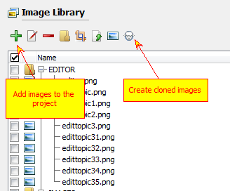

Prepare images for your guide. You can add existing images to the image library, capture some screenshots or create cloned images. Add callouts using image editor to emphasize meaning of the corresponding step.

2. Select guides node

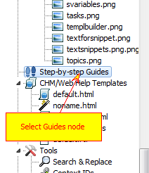

Select "Step-by-step Guides" node in the project tree view.

3. Click "Add Guide"

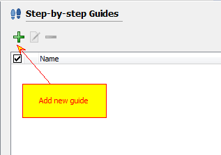

Click "Add Guide". New guide dialog box appears.

4. Name your guide

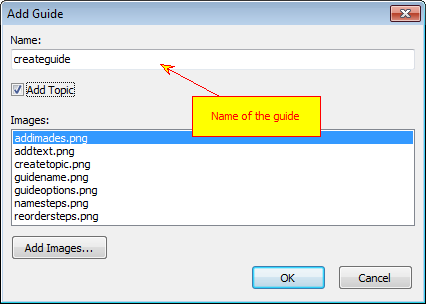

Give appropriate name to your guide. It is recommended to avoid use of spaces and special characters since this name will be used in "SBS" placeholder.

5. Create topic

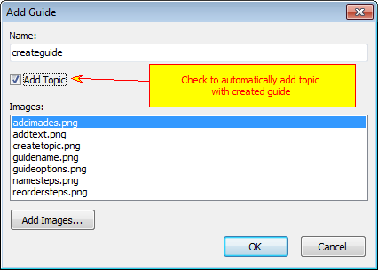

Check "Add topic" to automatically add topic with created guide. It will be added as the last topic in the project. You can use project tree drag and drop feature to put it in the correct place. 

If you leave it unchecked then you need to manually insert "SBS" placeholder into desired topic.

6. Add images

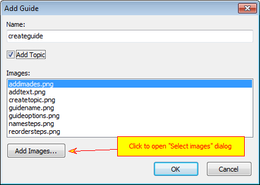

Click "Add images" button to add images for steps. You will be able to rearrange and rename steps later.

7. Select images to add to the guide

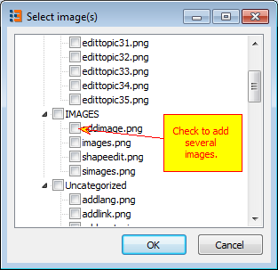

Select images for steps. Images are taken from the project's image library. Check as many images as you wish.

8. List of steps

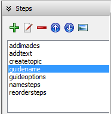

The list of steps is at the left top corner of the guide editor. On top of the list there are tool buttons to edit it.

9. Give short names to each step

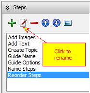

Click "Rename" to give appropriate titles for steps. 

10. Put steps in the correct order

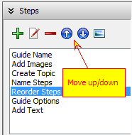

Reorder steps using "Up" and "Down" buttons.

11. Add descriptive text for each step

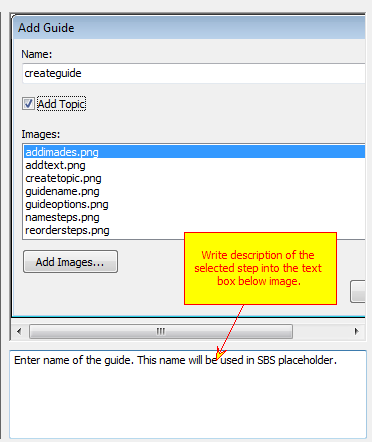

Write some descriptive text for each step. Be short, image should say for itself.

12. Set up guide options

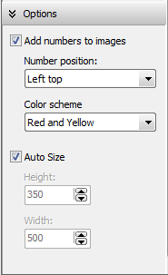

Guide options are at the left bottom row. Here you can select whether you want to add step numbers to step images, select color scheme to use for step numbers and where they should be located on the step image. Check "Auto size" if you want Helpinator to select size of the HTML box automatically, or set width and height manually.

