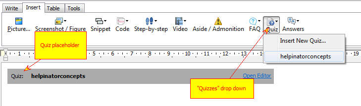
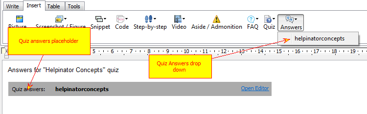

=====================
How to Embed a Quiz
=====================

You need to use QUIZ pseudo tag to embed a quiz into a topic and QUIZANSWERS tag for correct quiz answers (usually at the end of the printable doc). Of course you can place correct answers in HTML-based documentation as well, but it ruins experience for your users.

Optionally you can use editor drop down list to select a QUIZ and insert the tag in the place of caret.

Insert a quiz into a topic

Embed Quiz Answers into a topic

