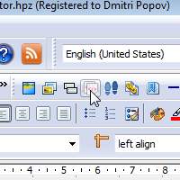
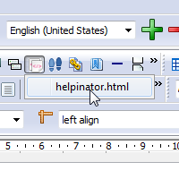
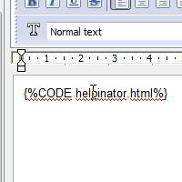

==========================
How to use code snippets
==========================

1. Click toolbar button

Locate "Insert code snippet" button on the topic editor toolbar and click it.

2. Select snippet

Drop-down list of available code snippets appears. Select code snippet to insert.

3. Placeholder appears

Code snippet placeholder appears in the position of caret.

