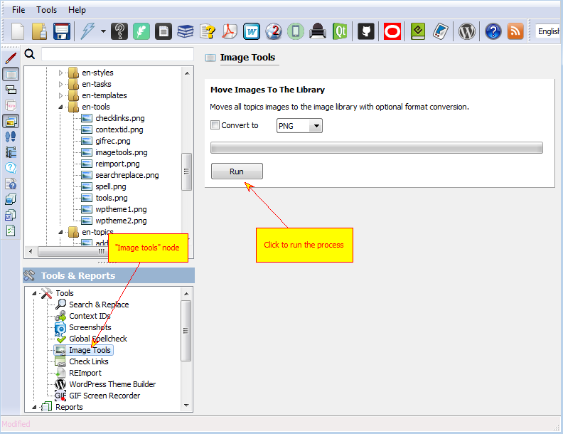

=============
Image Tools
=============

Image tools is a set of tools targeted at batch image transformation using project's image library.

Currently it has only one tool - "Move Images To The Library". It allows you to move all images from topics into the project's image library thus allowing to edit, reuse and recapture them. This is useful when your project is partially a product of conversion/import.

Image Tools

