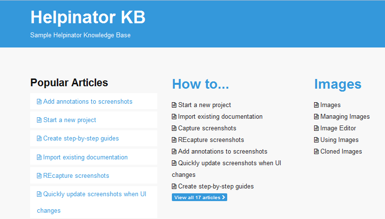

================
Knowledge Base
================

Knowledge base is a common documentation layout, without topic tree, or should we say, 2-level tree. There is no topic hierarchy, topics are grouped into "Categories". The main page has links to all topics. It looks like this:

To generate a Knowledge Base from an existing project you need to add "kbdefault" template to the project first.
