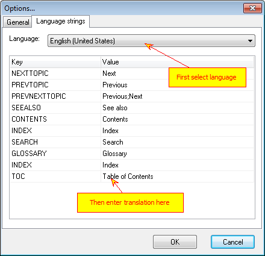

==================
Language strings
==================

Language strings allow you to translate common strings used in templates (like "Table of Contents" for example) into desired language. To do it call "Main Menu->Tools->Options" and select "Language Strings" tab. 

Language Strings

