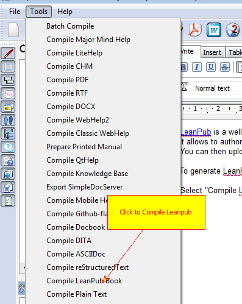
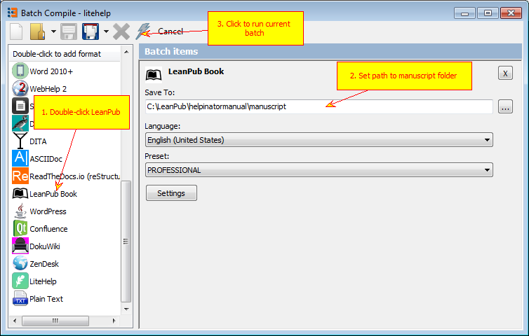

=========
LeanPub
=========

`LeanPub <https://www.leanpub.com>`_ is a well-designed and feature-rich platform for publishing ebook and paperback books combined with a digital storefront to sell your books.

It allows to author your books in plain text, using LeanPub-flavored markdown. Helpinator allows to generate markdown source project for your LeanPub book from your project.

You can then upload generated content to DropBox or GitHub and allow LeanPub to consume it.

To generate LeanPub source project (manuscript) you can do the following:

Select "Compile LeanPub book" from the "Tools" menu.

Tools - Compile LeanPub

or create a batch with this command:

LeanPub batch compile

There's a post on our blog that covers in detail the whole process of publishing your project on LeanPub:  `https://www.helpinator.com/blog/2019/08/23/leanpub-tutorial-publishing-your-book-using-helpinator/ <https://www.helpinator.com/blog/2019/08/23/leanpub-tutorial-publishing-your-book-using-helpinator/>`_

