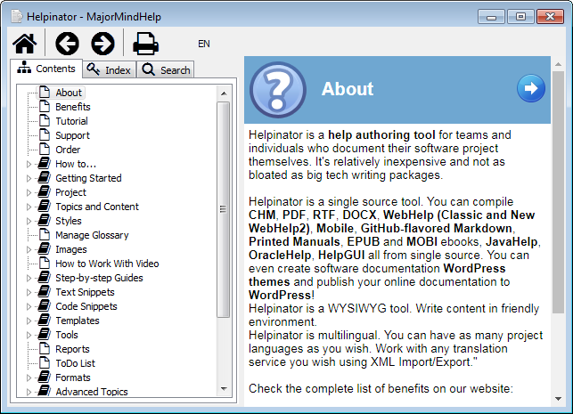

===============
MajorMindHelp
===============

MajorMindHelp is our own help system for Windows applications. It is based on MajorMindHelpViewer - a viewer utility that is more than just a CHM-alike help system. You can read more about it in topic  `MajorMindHelpViewer <#t267836CF2026406C80E4FE41ECB548B5>`_.

Main features:

1. HTML-based, full-featured help system.

2. Compiles right into Delphi application, no standalone files or help systems required

3. No problems with CHM help files security

4. No problems with WebHelp cross-browser compatibility and security settings.

5. Multilingual. All languages are in one help file and they can be easily switched between.

6. Transparent help file format - just a zip file with HTML and XML in it.

Helpinator compiles MajorMindHelp directly, without any other tools.

Compiled Help looks like this:

