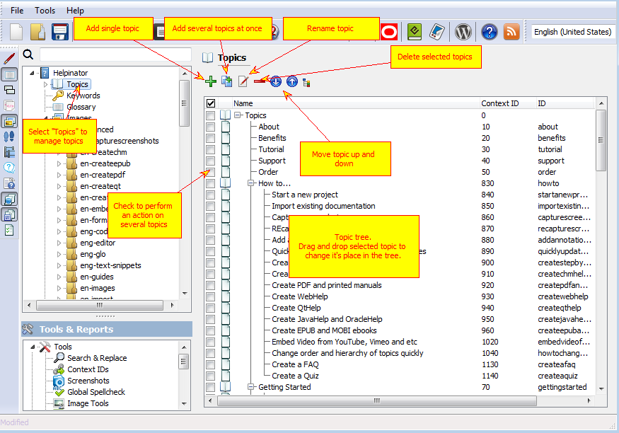
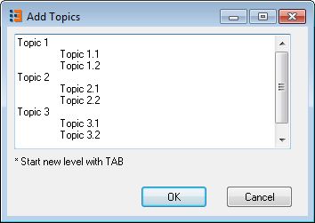

===============
Manage Topics
===============

Topic manager resides under "Topics" node of the project tree view.

Manage Topics

When you click "Add several topics" separate dialog box appears:

Add several topics

Here you can add a bunch of topics as children of the selected topic and also with hierarchy. Just start new levels with TAB.

