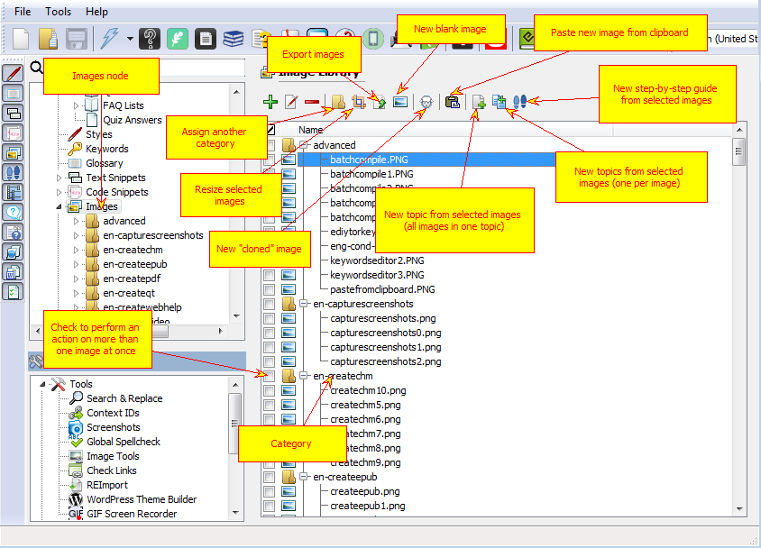
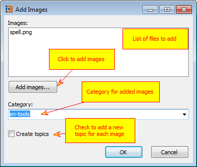
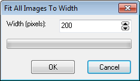
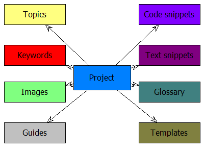
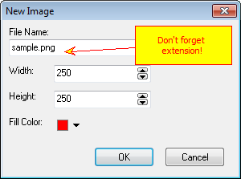

=================
Managing Images
=================

Image Library UI has a toolbar with commands and tree list of images, organized into categories.

Image Library

Toolbar has the following commands:

1. Add Image from file
2. Rename image (selected images)
3. Delete image (selected images)
4. Assign new category to selected images
5. Resize selected images
6. Export selected images
7. New blank image
8. New cloned image

Add Image from file opens up separate dialog:

Add image from file

"Resize selected images" command allows you to resize images that have width in pixels more than selected value. This is useful when you have captured a bunch of screenshots that do not fit browser or PDF page width.

Resize Images

"New blank image" allows you to create an image with user defined size and filled with selected color. Using it and annotations you can create diagrams like this:

Shapes drawn above a blank image

New Blank Image

"Cloned" images are explained in detail in this topic:  `"Cloned Images" <#t5890F9CEE0ED4E1EAB467299DE7A456D>`_
