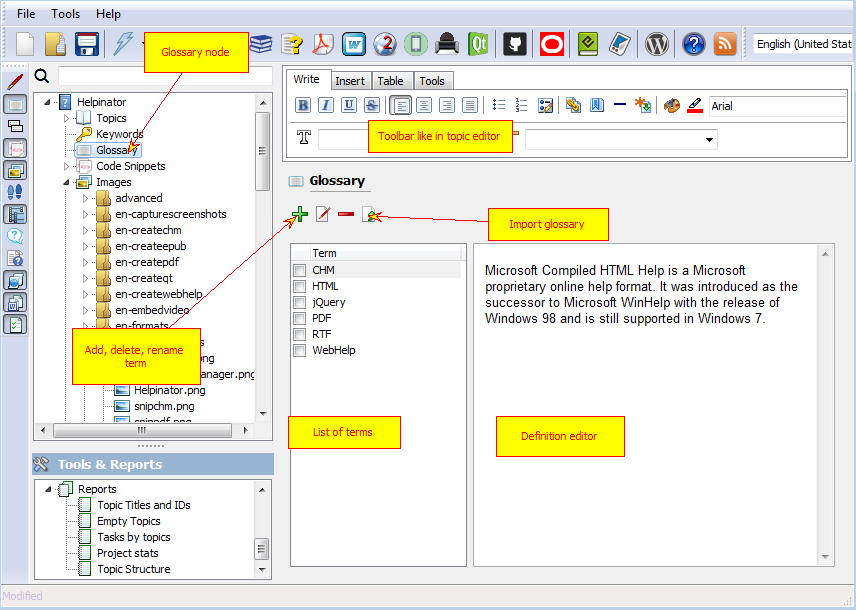
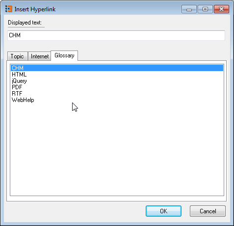

=================
Manage Glossary
=================

Helpinator allows you to create, manage and reference Glossary of terms specific to your project. 

Glossary

To insert a link to a glossary term use "Glossary" tab in the "Insert Hyperlink" editor dialog:

Insert a glossary hyperlink

