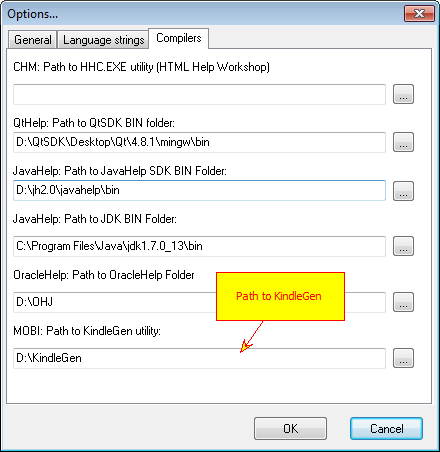

======
MOBI
======

MOBI is a ebook format introduced by a company called Mobipocket. Now it is used in Amazon Kindle devices. Helpinator allows you to create MOBI ebooks with single mouse click.

To compile MOBI format ebooks you need KindleGen utility from Amazon:

`http://www.amazon.com/gp/feature.html?ie=UTF8&docId=1000765211 <http://www.amazon.com/gp/feature.html?ie=UTF8&docId=1000765211>`_

To compile MOBI ebook:

1. Donwload and install KindleGen

2. Run Helpinator, select Main Menu->Tools->Options, "Compilers" tab and enter path to KindleGen utility.

KindleGen

You might also need a MOBI viewer (Mobipocket Reader for example or  `Kindle Previewer <http://www.amazon.com/gp/feature.html?ie=UTF8&docId=1000765261>`_).

Note that you can add a cover page image to your ebook (actually Amazon suggests you have one). Just put a file named syscoverpage.jpg into the project's image library and Helpinator will use it as a cover page for your ebook.

Kindle Book Preview

