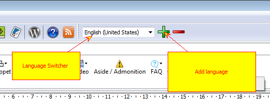

====================
Multiple languages
====================

Additional languages in your project affect:

1. Topic titles and content
2. Project and topic keywords
3. Glossary
4. Text snippets

**Important notice!**

To compile CHM help files with locale different from your default system locale you might need **SbAppLocale.exe** tool. Microsoft CHM compiler is not always capable of compiling correct CHM files with other locales, for example it will fail to compile Cyrillic locales on US versions of Windows. 

The tool can be found here:

`http://www.steelbytes.com/?mid=45 <http://www.steelbytes.com/?mid=45>`_

Download it and put into Helpinator installation folder.

To add languages to your project you can either use "Add languages" button in the "New Project" dialog or "+" sign on the main tool bar next to the language drop-down list.

Add Languages

