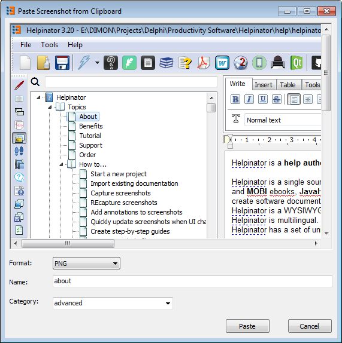

======================
Paste from Clipboard
======================

If you prefer to use another screenshot capture tool or just Windows **PrntScrn** built-in function Helpinator allows to quickly add captured screenshot from the Clipboard. Just place the cursor in the topic editor where you want to place the screenshot and click "Ctrl+Alt+V" or select "Paste Screenshot from Clipboard" in the right-click pop-up menu.

"Paste screenshot..." dialog appears. Select image name, format and category, then click "Paste".

Paste from Clipboard

