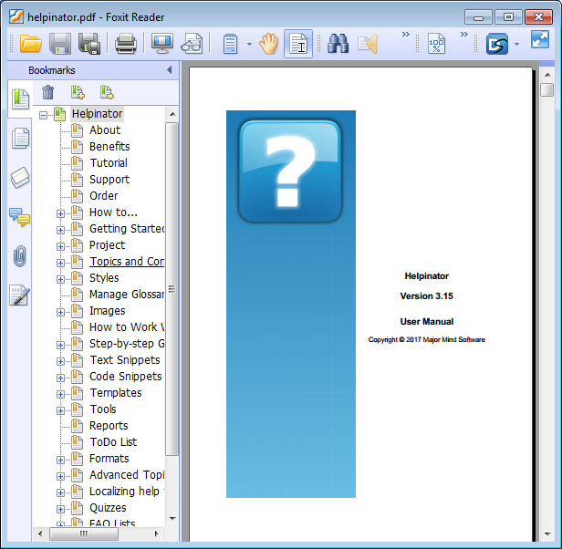
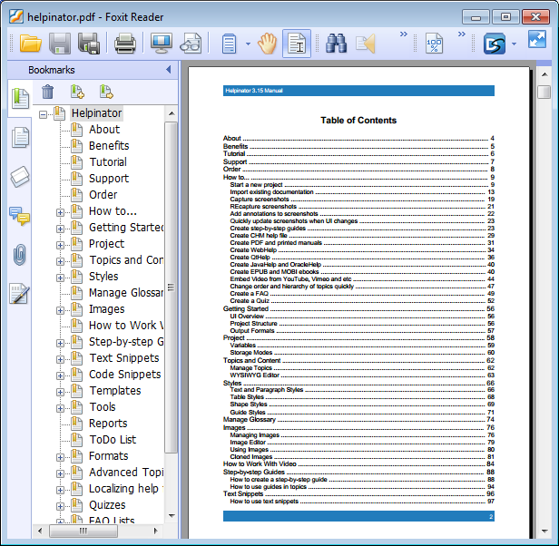
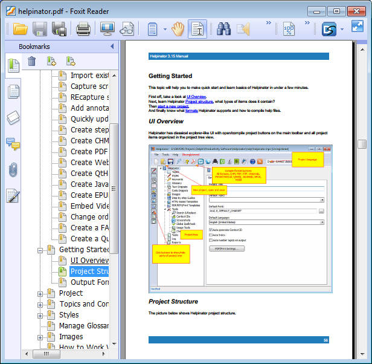
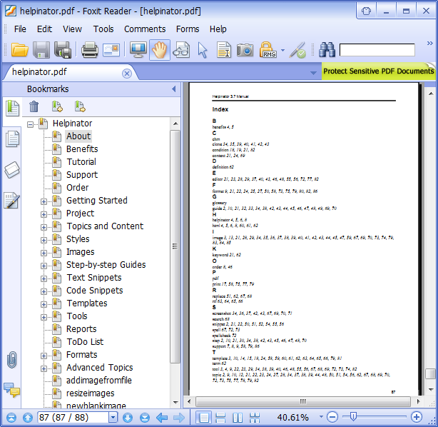

=========
PDF/RTF
=========

Helpinator generates PDF files with cover page, table of contents, glossary and index based on PDF/RTF template. TOC consists of hyperlinks, e.g. you can click on topic titles to go to corresponding topic. The same can be archived using navigation bookmarks tree on the left pane.

Pages have header and footer with page numbers.

PDF - cover page

PDF - Table of Contents

PDF  - topic

PDF - index

