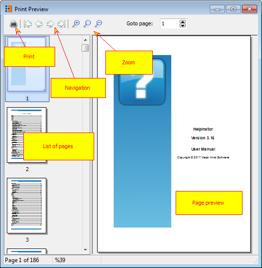

=================
Printed Manuals
=================

Printed manuals act the same way and use the same template and settings as PDF format output, but instead of a file pages are sent directly to printer. When you click "Create printed manual" Helpinator shows you "Preview" dialog with pages that are about to be printed. You can navigate them, zoom in and out, and when you are satisfied - click on "Print" to print them.

Printed Manual

