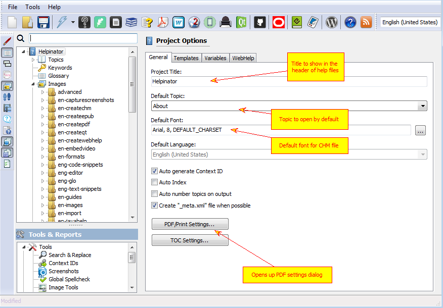
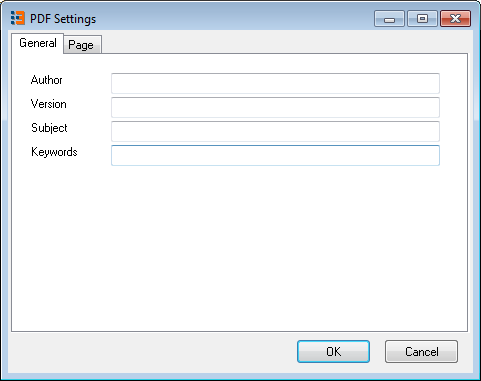
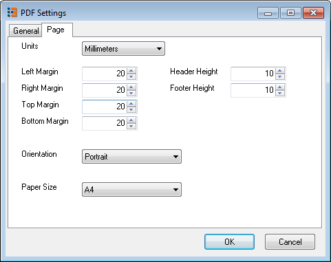

=========
Project
=========

Project options define global project-wide settings.

Project Options

+-------------------------+--------------------------------------------------------------------------------------------------------------------------------------------------------------------------------------------------+
|**Option**               |**How it works**                                                                                                                                                                                  |
+-------------------------+--------------------------------------------------------------------------------------------------------------------------------------------------------------------------------------------------+
|Auto generate Context IDs|Helpinator will generate unique context ID every time you add a new topic or anchor                                                                                                               |
+-------------------------+--------------------------------------------------------------------------------------------------------------------------------------------------------------------------------------------------+
|Auto Index               |If this option is checked you don't need to assign keywords to each topic. Just fill the list of project keywords and Helpinator will assign them to topics automatically, based on topic content.|
+-------------------------+--------------------------------------------------------------------------------------------------------------------------------------------------------------------------------------------------+
|Auto number topics...    |Helpinator will put sequential topic number in front of topic title when generating help files.                                                                                                   |
+-------------------------+--------------------------------------------------------------------------------------------------------------------------------------------------------------------------------------------------+

Clicking on "PDF/Print settings" opens up "PDF settings" dialog. First page "General" allows you to define special fields of PDF document.

General Project Options

The second acts both for PDF and for printed manuals. Here you can define margins, orientation and paper size.

PDF Settings

