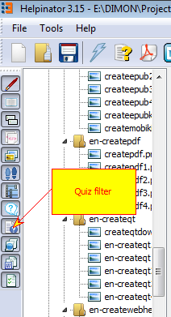
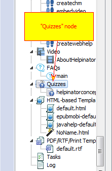
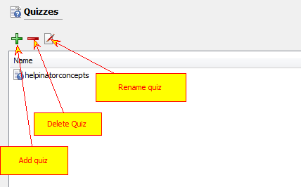
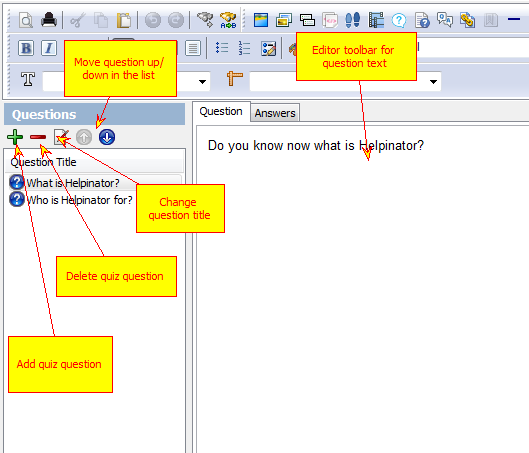
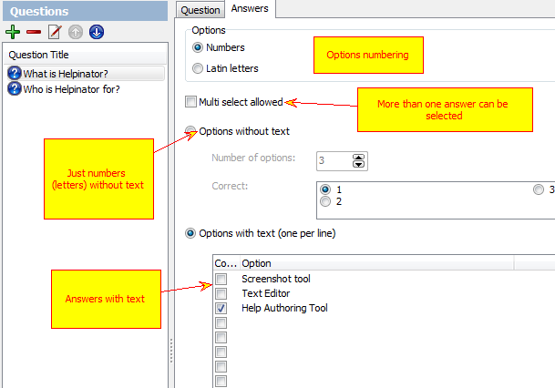

=========================
Quizzes Editor Overview
=========================

To activate Quiz Editor first select "Quizzes"  node in the project tree view. If it is not visible, then click "Quizzes" button on the project tree filter toolbar:

Filter Quizzes in the tree

Quizzes node

List of Quizzes looks like this:

Quiz list

Double click a quiz in the list and the Quiz Editor appears:

Quiz Question Editor

Quiz Answers Editor

