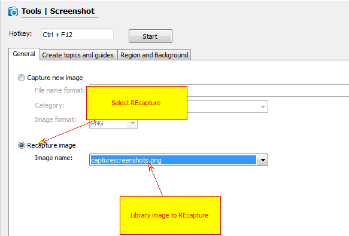

=======================
REcapture screenshots
=======================

If you store all your screenshots in the image library of your project you can easily recapture screenshots. This saves you a lot of time because you don't need to capture screenshots, find topics that you need to update and insert new images instead of old ones. With Helpinator you only need to select "REcapture" mode in the screenshot tool and select image from the library to recapture. **Note that callouts remain the same**, only image itself changes.

Recapture a Screenshot

