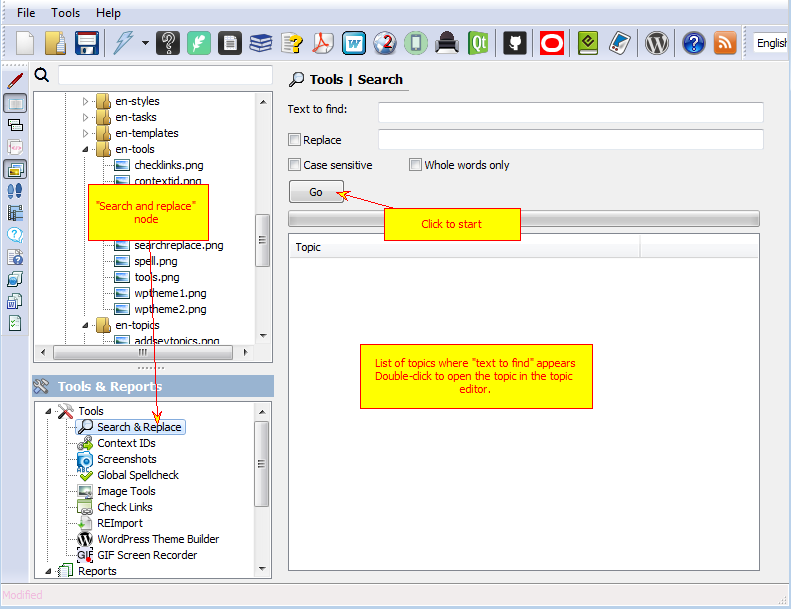

====================
Search and Replace
====================

"Search and Replace" tool allows you to get a list of topics where certain phrase appears and optionally replace those occurrences.

Search and Replace

To replace a text everywhere in your project:

1. Check "Replace" option.

2. Enter text to replace "text to find" with.

3. Click "Go"
