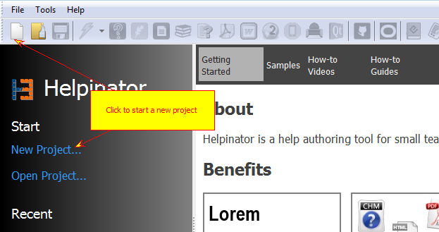
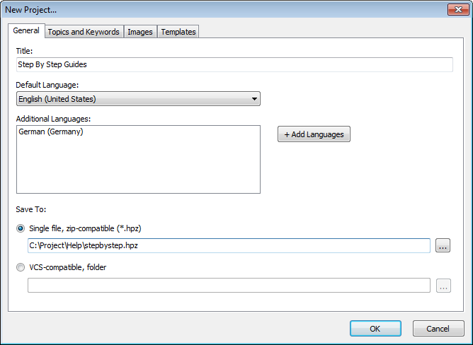
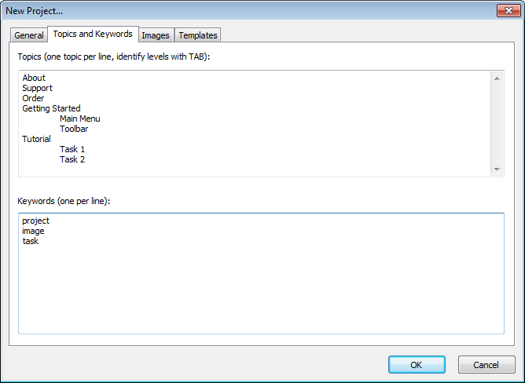
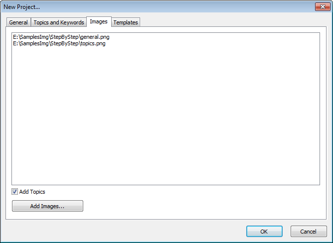
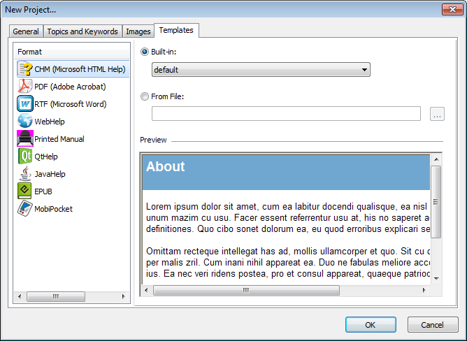

=====================
Start a new project
=====================

1. Click "New project"

Click "New project" on the toolbar on in the welcome screen

2. Adjust General Settings

At this step you can select project default language and additional languages. You can also select storage mode and path to save your new project to.

3. Add Topics and Keywords

Here you can add some topics and keywords to start new project with. Use TABs for new levels.

4. Add Images

If you already have some captured screenshots you can add them to your project at this step. Click "Add Images" and select image files. You can also check "Add topics" to add new topics for each of the added images.

5. Select Templates

Select templates for all supported formats. You can select from built-in templates or choose your own template stored outside of Helpinator installation.

