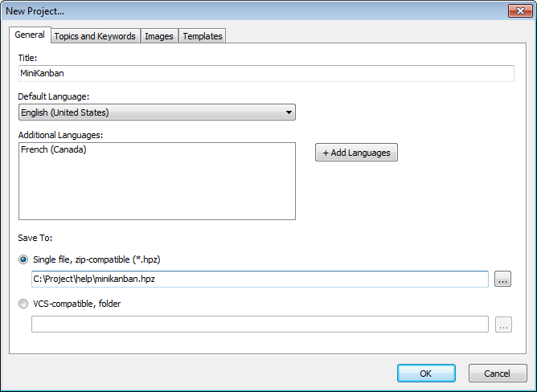
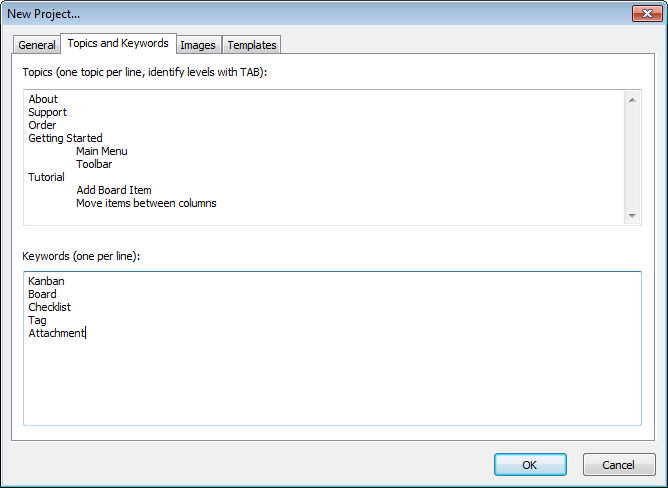
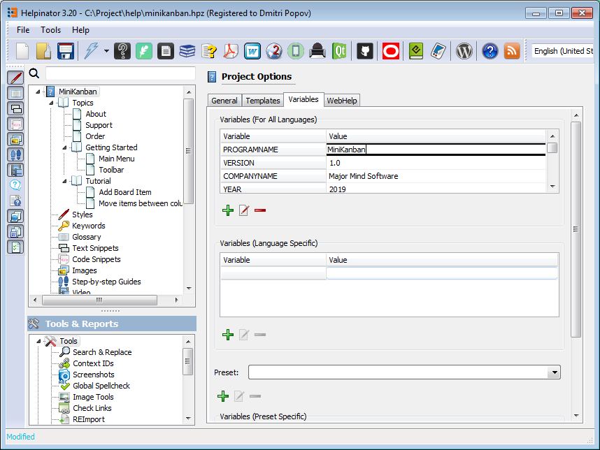

========================
Starting a new project
========================

When you run Helpinator you see "Welcome" screen with links to documentation, blog and most common actions. Click on the "New Project" link. 

.. image:: images/newproject0.png

New project

"New project" dialog appears. 

New project - General tab

Enter project title here. If you plan to create multi-lingual project, it's a good time to click "Add languages" and select additional languages for this project.

Now select "Topics and keywords" tab. Enter topic titles and basic keywords. Don't worry if you can't think of any right now - you'll be able to add them at any time. 

New project - topics and keywords

On "Templates" tabs you can select predefined templates for different types of documentation. For now we'll leave default settings there.

When everything is ready click "OK". Helpinator opens up newly created project.

Now let's select "Variables" tab and enter your product's and company name, version and year of the release. The first step is done. 

Project variables

