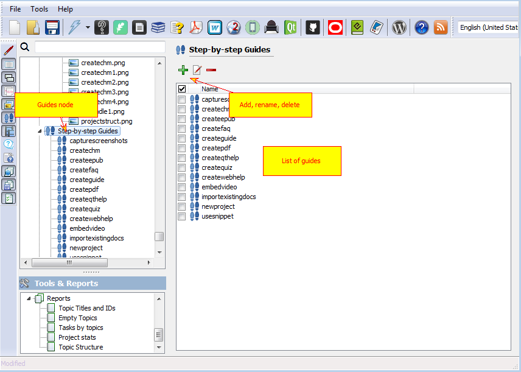

=====================
Step-by-step Guides
=====================

Step-by-step guides allow you to document procedures that users have to follow to accomplish certain task. Each guide consists of steps. You can add as many steps as you want, but it's a good idea to limit yourself to 10-15. Each step has:

1. Title
2. Descriptive text about actions to perform on this step
3. Image from project's Image Library. You can use plain images/screenshots, but it's better to  `annotate them <#t449D3E1738EB47318F5179EFB4010186>`_. If your guide uses lots of similar images with different annotations - then you might want to use  `cloned images <#t5890F9CEE0ED4E1EAB467299DE7A456D>`_ for steps.

Helpinator stores all guides in a place similar to Image Library.

Manage guides

