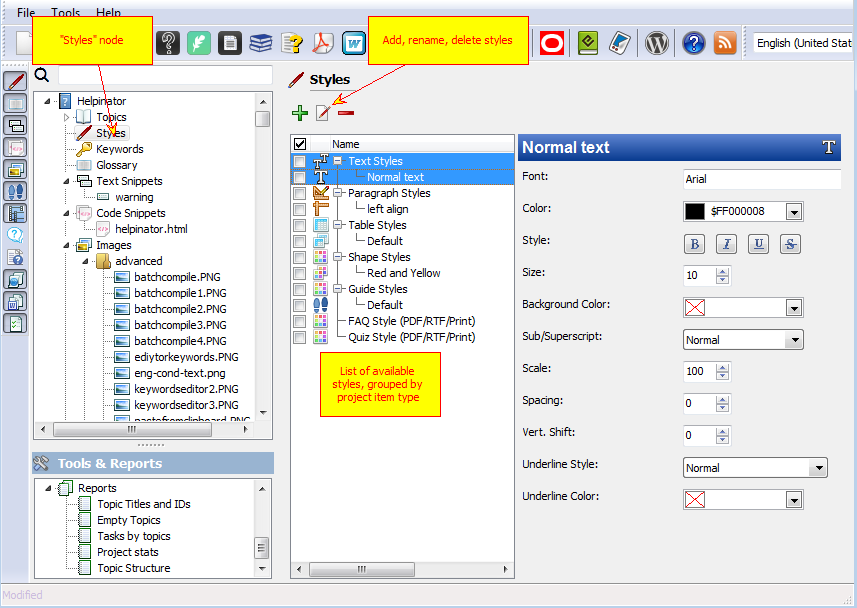

========
Styles
========

You can add named styles for virtually any object in Helpinator. Global named styles allow you to keep the same formatting everywhere and change the way items look in a matter of few clicks.

Styles

